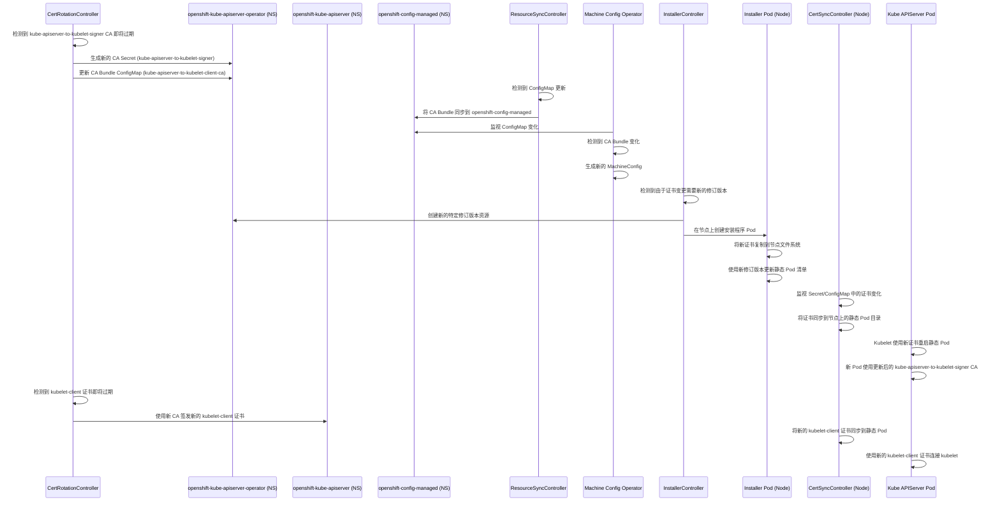

# kube-apiserver-to-kubelet-signer 证书轮替流程分析

本文档详细分析了 OpenShift 中 `kube-apiserver-to-kubelet-signer` 证书的轮替流程，以及新证书如何下发到节点的静态 Pod 中。

## 涉及的核心组件

证书轮替流程涉及以下几个关键组件：

1. **CertRotationController**: 负责轮替证书，包括 `kube-apiserver-to-kubelet-signer` CA 证书。
2. **ResourceSyncController**: 在不同命名空间之间同步证书和 CA 包。
3. **InstallerController**: 创建安装程序 Pod，用于更新节点上的静态 Pod 资源。
4. **CertSyncController**: 将证书从 Secret/ConfigMap 同步到静态 Pod 的文件系统。
5. **Machine Config Operator (MCO)**: 检测证书变更并更新节点配置。

## 证书轮替流程



## 详细流程说明

### 1. 证书颁发机构 (CA) 轮替

从 `pkg/operator/certrotationcontroller/certrotationcontroller.go` 源代码中，我们可以看到 `kube-apiserver-to-kubelet-signer` CA 的有效期为 1 年，刷新周期为 8 年：

```go
certRotator = certrotation.NewCertRotationController(
    "KubeAPIServerToKubeletClientCert",
    certrotation.RotatedSigningCASecret{
        Namespace:              operatorclient.OperatorNamespace,
        Name:                   "kube-apiserver-to-kubelet-signer",
        Validity:               1 * 365 * defaultRotationDay, // 来自安装程序
        Refresh:                8 * 365 * defaultRotationDay, // 这意味着我们实际上不轮替
        RefreshOnlyWhenExpired: refreshOnlyWhenExpired,
        // ...
    },
    // ...
)
```

轮替过程始于 `CertRotationController` 检测到 CA 证书即将过期。然后它会：

1. 生成新的 CA 证书和密钥
2. 将它们存储在 `openshift-kube-apiserver-operator` 命名空间的 `kube-apiserver-to-kubelet-signer` Secret 中
3. 使用新的 CA 证书更新 `kube-apiserver-to-kubelet-client-ca` CA Bundle ConfigMap

### 2. 资源同步

`ResourceSyncController` 检测到 CA Bundle ConfigMap 的变化，并将其同步到 `openshift-config-managed` 命名空间：

```go
if err := resourceSyncController.SyncConfigMap(
    resourcesynccontroller.ResourceLocation{Namespace: operatorclient.OperatorNamespace, Name: "kube-apiserver-to-kubelet-client-ca"},
    resourcesynccontroller.ResourceLocation{Namespace: operatorclient.GlobalMachineSpecifiedConfigNamespace, Name: "kubelet-serving-ca"},
); err != nil {
    return nil, err
}
```

### 3. Machine Config Operator 检测

Machine Config Operator (MCO) 监控 `openshift-config-managed` 命名空间中的资源。当它检测到 CA Bundle ConfigMap 的变化时，它会：

1. 为主节点生成新的 MachineConfig
2. 通过 Machine Config Daemon (MCD) 将此配置应用到每个节点
3. MCD 将更新后的 CA Bundle 文件写入节点上的特定路径

### 4. 静态 Pod 更新过程

`InstallerController` 负责更新每个节点上的静态 Pod 清单。当检测到证书变化时：

1. 它为静态 Pod 资源创建一个新的修订版本
2. 在每个节点上依次创建安装程序 Pod
3. 安装程序 Pod 将新证书和其他资源复制到节点的文件系统
4. 使用新的修订版本更新静态 Pod 清单

在每个节点上运行的 `CertSyncController` 持续监视证书 Secret 和 ConfigMap 的变化：

```go
func (c *CertSyncController) sync(ctx context.Context, syncCtx factory.SyncContext) error {
    // ...
    for _, s := range c.secrets {
        secret, err := c.secretLister.Secrets(c.namespace).Get(s.Name)
        // ...
        if err := staticpod.WriteFileAtomic(content, 0600, fullFilename); err != nil {
            // ...
        }
        // ...
    }
    // ...
}
```

它将更新后的证书写入节点文件系统上的适当目录，使静态 Pod 可以使用它们。

### 5. Kubelet 客户端证书轮替

在 CA 轮替后，`CertRotationController` 还会轮替 kube-apiserver 用于连接 kubelet 的 `kubelet-client` 证书：

```go
certRotation.RotatedSelfSignedCertKeySecret{
    Namespace:              operatorclient.TargetNamespace,
    Name:                   "kubelet-client",
    Validity:               30 * rotationDay,
    Refresh:                15 * rotationDay,
    RefreshOnlyWhenExpired: refreshOnlyWhenExpired,
    CertCreator: &certrotation.ClientRotation{
        UserInfo: &user.DefaultInfo{Name: "system:kube-apiserver", Groups: []string{"kube-master"}},
    },
    // ...
}
```

此证书由新的 CA 签名，并存储在 `openshift-kube-apiserver` 命名空间的 `kubelet-client` Secret 中。

### 6. 静态 Pod 重启

当 kubelet 检测到静态 Pod 清单或挂载的 ConfigMap/Secret 发生变化时：

1. 它终止现有的静态 Pod
2. 使用更新后的清单启动新的 Pod
3. 新 Pod 加载新的证书和 CA Bundle
4. kube-apiserver 现在使用由新 CA 签名的新 `kubelet-client` 证书连接 kubelet

## 关键观察

1. `kube-apiserver-to-kubelet-signer` CA 的有效期为 1 年，但刷新周期为 8 年，表明它不打算频繁轮替。

2. 证书分发到节点的过程通过以下组合完成：
   - ResourceSyncController 在命名空间之间同步证书
   - InstallerController 在节点上创建安装程序 Pod
   - CertSyncController 将证书写入节点文件系统
   - Kubelet 在证书变化时重启静态 Pod

3. 该过程设计为顺序执行且尽量减少中断，一次更新一个节点，以保持控制平面的可用性。

这个全面的流程确保了当 `kube-apiserver-to-kubelet-signer` 证书轮替时，新证书能够正确分发到所有节点，并且 kube-apiserver 静态 Pod 能够更新使用它们。
