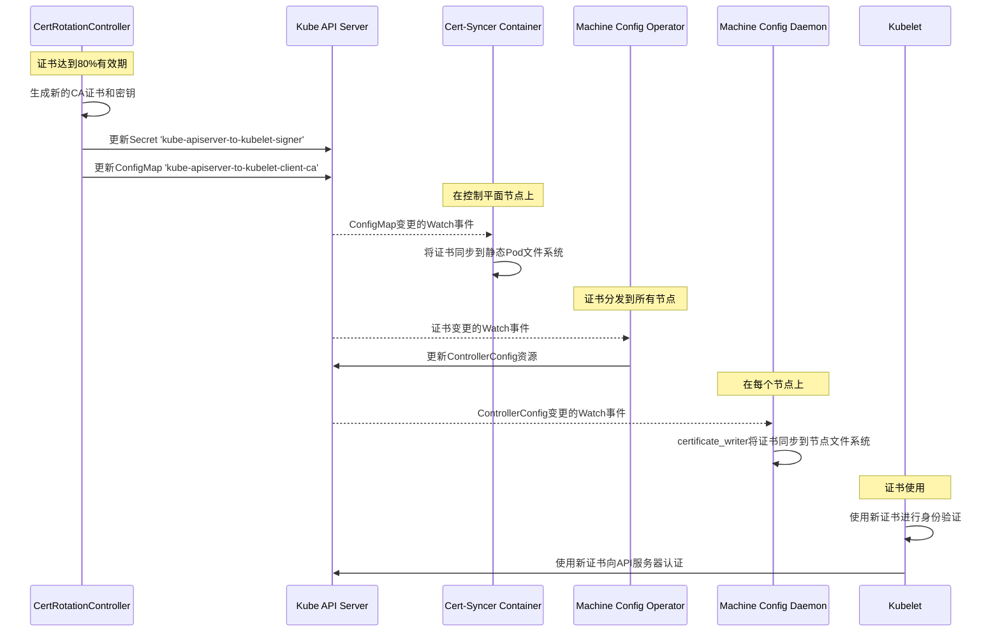

# kube-apiserver-to-kubelet-signer 证书轮换流程分析

基于对 cluster-kube-apiserver-operator 和 machine-config-operator 代码库的分析，以下是 kube-apiserver-to-kubelet-signer 证书轮换的完整流程，以及新证书如何分发到节点静态 Pod 的过程。

## 证书轮换流程

### 1. 证书轮换启动

证书轮换过程始于 cluster-kube-apiserver-operator 中的 `CertRotationController`。从 `certrotationcontroller.go` 源代码中，我们可以看到 kube-apiserver-to-kubelet-signer 证书的配置：

```go
certRotator = certrotation.NewCertRotationController(
    "KubeAPIServerToKubeletClientCert",
    certrotation.RotatedSigningCASecret{
        Namespace: operatorclient.OperatorNamespace,
        Name:      "kube-apiserver-to-kubelet-signer",
        AdditionalAnnotations: certrotation.AdditionalAnnotations{
            JiraComponent: "kube-apiserver",
        },
        Validity: 1 * 365 * defaultRotationDay, // this comes from the installer
        // Refresh set to 80% of the validity.
        // This range is consistent with most other signers defined in this pkg.
        Refresh:                292 * defaultRotationDay,
        RefreshOnlyWhenExpired: refreshOnlyWhenExpired,
        Informer:               kubeInformersForNamespaces.InformersFor(operatorclient.OperatorNamespace).Core().V1().Secrets(),
        Lister:                 kubeInformersForNamespaces.InformersFor(operatorclient.OperatorNamespace).Core().V1().Secrets().Lister(),
        Client:                 kubeClient.CoreV1(),
        EventRecorder:          eventRecorder,
    },
    // ... 其他配置 ...
)
```

关键点：
- 证书有效期为1年（365天）
- 当证书达到其有效期的80%（292天）时触发轮换
- 证书存储在操作员命名空间中名为 "kube-apiserver-to-kubelet-signer" 的 Secret 中

### 2. 证书生成

当触发轮换时，`CertRotationController` 执行以下操作：

1. 生成新的 CA 证书和密钥
2. 更新包含签名者证书的 Secret
3. 使用新的 CA 包更新 ConfigMap "kube-apiserver-to-kubelet-client-ca"

这由 `client_cert_rotation_controller.go` 文件中的 `SyncWorker` 方法处理：

```go
func (c CertRotationController) SyncWorker(ctx context.Context) error {
    signingCertKeyPair, err := c.RotatedSigningCASecret.EnsureSigningCertKeyPair(ctx)
    if err != nil {
        return err
    }

    cabundleCerts, err := c.CABundleConfigMap.EnsureConfigMapCABundle(ctx, signingCertKeyPair)
    if err != nil {
        return err
    }

    if _, err := c.RotatedSelfSignedCertKeySecret.EnsureTargetCertKeyPair(ctx, signingCertKeyPair, cabundleCerts); err != nil {
        return err
    }

    return nil
}
```

### 3. 证书分发到控制平面节点

kube-apiserver 静态 Pod 包含一个名为 "kube-apiserver-cert-syncer" 的容器，运行 cert-syncer 控制器。从 pod.yaml 模板中可以看到：

```yaml
- name: kube-apiserver-cert-syncer
  env:
  - name: POD_NAME
    valueFrom:
      fieldRef:
        fieldPath: metadata.name
  - name: POD_NAMESPACE
    valueFrom:
      fieldRef:
        fieldPath: metadata.namespace
  image: {{.OperatorImage}}
  imagePullPolicy: IfNotPresent
  terminationMessagePolicy: FallbackToLogsOnError
  command: ["cluster-kube-apiserver-operator", "cert-syncer"]
  args:
    - --kubeconfig=/etc/kubernetes/static-pod-resources/configmaps/kube-apiserver-cert-syncer-kubeconfig/kubeconfig
    - --namespace=$(POD_NAMESPACE)
    - --destination-dir=/etc/kubernetes/static-pod-certs
```

cert-syncer 控制器：
- 监视 openshift-kube-apiserver 命名空间中 ConfigMap 和 Secret 的变化
- 当检测到变化时，将内容同步到指定的目标目录的文件系统
- 对于 kube-apiserver-to-kubelet-signer，这会将 CA 包同步到静态 Pod 的文件系统

从 `certsync_controller.go` 文件中：

```go
func (c *CertSyncController) sync(ctx context.Context, syncCtx factory.SyncContext) error {
    // ... 同步 configmap 的代码 ...
    
    for _, s := range c.secrets {
        secret, err := c.secretLister.Secrets(c.namespace).Get(s.Name)
        // ... 错误处理 ...
        
        contentDir := getSecretDir(c.destinationDir, s.Name)
        
        // ... 检查内容是否已更改 ...
        
        for filename, content := range secret.Data {
            fullFilename := filepath.Join(contentDir, filename)
            // ... 写入文件 ...
            if err := staticpod.WriteFileAtomic(content, 0600, fullFilename); err != nil {
                // ... 错误处理 ...
            }
        }
        c.eventRecorder.Eventf("CertificateUpdated", "Wrote updated secret: %s/%s", secret.Namespace, secret.Name)
    }
    
    return utilerrors.NewAggregate(errors)
}
```

### 4. 证书分发到所有节点

Machine Config Operator (MCO) 在将证书分发到集群中的所有节点方面起着至关重要的作用：

1. MCO 监视证书变化并更新 ControllerConfig 资源
2. Machine Config Daemon (MCD) 在每个节点上运行并监视 ControllerConfig
3. 当 ControllerConfig 发生变化时，MCD 的 certificate_writer 将证书同步到节点的文件系统

从 machine-config-operator 中的 `certificate_writer.go` 文件：

```go
func (dn *Daemon) syncControllerConfigHandler(key string) error {
    // ... 代码 ...
    
    controllerConfig, err := dn.ccLister.Get(ctrlcommon.ControllerConfigName)
    if err != nil {
        return fmt.Errorf("could not get ControllerConfig: %v", err)
    }
    
    // ... 代码 ...
    
    if currentNodeControllerConfigResource != controllerConfig.ObjectMeta.ResourceVersion || controllerConfig.Annotations[ctrlcommon.ServiceCARotateAnnotation] == ctrlcommon.ServiceCARotateTrue {
        pathToData := make(map[string][]byte)
        kubeAPIServerServingCABytes := controllerConfig.Spec.KubeAPIServerServingCAData
        cloudCA := controllerConfig.Spec.CloudProviderCAData
        pathToData[caBundleFilePath] = kubeAPIServerServingCABytes
        pathToData[cloudCABundleFilePath] = cloudCA
        
        // ... 代码 ...
        
        if err := writeToDisk(pathToData); err != nil {
            return err
        }
        
        // ... 代码 ...
    }
    
    // ... 代码 ...
    
    klog.Infof("Certificate was synced from controllerconfig resourceVersion %s", controllerConfig.ObjectMeta.ResourceVersion)
    
    // ... 代码 ...
}
```

证据文件中的日志确认了这一过程：

```
I0410 15:59:14.239434   31662 certificate_writer.go:303] Certificate was synced from controllerconfig resourceVersion 23344
I0410 15:59:15.621037   31662 certificate_writer.go:303] Certificate was synced from controllerconfig resourceVersion 23346
I0410 15:59:15.950768   31662 certificate_writer.go:303] Certificate was synced from controllerconfig resourceVersion 23347
```

### 5. 证书使用

一旦证书同步到所有节点：
- kubelet 使用这些证书向 kube-apiserver 进行身份验证
- 对于这种特定的证书轮换，不需要重启 kubelet

node.log 证据文件显示了正常的 Pod 操作，没有任何服务重启或重新加载，确认证书轮换过程是无缝的。

## 时序图



这个图表说明了证书轮换从 CertRotationController 到集群中所有节点的完整流程，以及 kubelet 最终如何使用这些证书向 kube-apiserver 进行身份验证。
