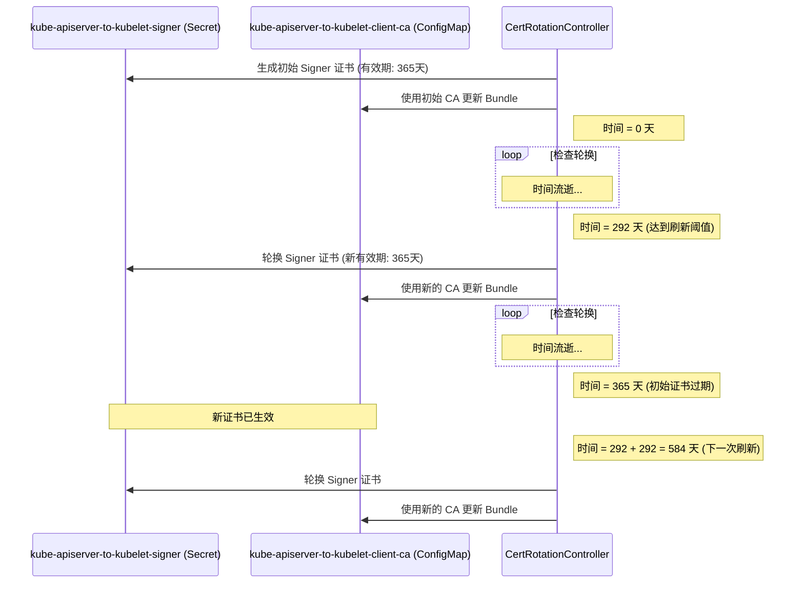

# kube-apiserver-to-kubelet-client-ca 证书有效期与轮换周期分析

## 问题

`kube-apiserver-to-kubelet-client-ca` 这个 CA bundle 的有效期是多久？轮换周期是多久？

## 分析来源

分析基于 `cluster-kube-apiserver-operator` 项目中的源代码文件：

*   `pkg/operator/certrotationcontroller/certrotationcontroller.go`

## 核心代码片段

在 `certrotationcontroller.go` 文件中，定义了 `KubeAPIServerToKubeletClientCert` 证书轮换的相关配置。其中，`kube-apiserver-to-kubelet-client-ca` (ConfigMap) 的内容来源于 `kube-apiserver-to-kubelet-signer` (Secret) 中的 CA 证书。该 signer secret 的有效期 (Validity) 和刷新周期 (Refresh) 定义如下：

```go
certRotator = certrotation.NewCertRotationController(
    "KubeAPIServerToKubeletClientCert",
    certrotation.RotatedSigningCASecret{
        Namespace: operatorclient.OperatorNamespace,
        Name:      "kube-apiserver-to-kubelet-signer", // Signer Secret 名称
        // ... 其他配置省略 ...
        Validity: 1 * 365 * defaultRotationDay, // 有效期：1 * 365 * 24小时 = 365天 (1年)
        // Refresh 设置为有效期的 80%
        Refresh:                292 * defaultRotationDay, // 刷新周期：292 * 24小时 = 292天
        // ... 其他配置省略 ...
    },
    certrotation.CABundleConfigMap{
        Namespace: operatorclient.OperatorNamespace,
        Name:      "kube-apiserver-to-kubelet-client-ca", // CA Bundle ConfigMap 名称
        // ... 其他配置省略 ...
    },
    // ... 其他配置省略 ...
)

// defaultRotationDay 定义为 24 小时
const defaultRotationDay = 24 * time.Hour
```

## 结论

根据源代码分析：

1.  `kube-apiserver-to-kubelet-signer` 证书（用于生成 `kube-apiserver-to-kubelet-client-ca` 中的 CA）的 **有效期 (Validity) 为 1 年（365 天）**。
2.  该证书的 **刷新/轮换 (Refresh) 周期被设置为 292 天**。这意味着证书控制器会在证书创建 292 天后开始尝试轮换该证书，生成新的 CA 并更新到 `kube-apiserver-to-kubelet-client-ca` ConfigMap 中。

## 时间线示意图 (Mermaid)

