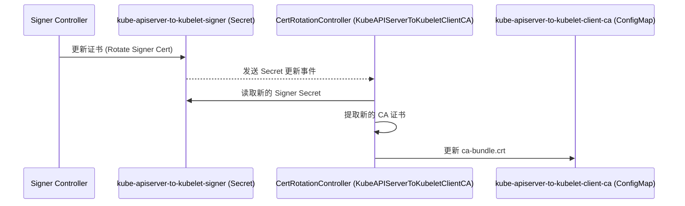

# kube-apiserver-to-kubelet-client-ca 与 kube-apiserver-to-kubelet-signer 的关系分析

## 问题

`kube-apiserver-to-kubelet-client-ca` ConfigMap 是否会随着 `kube-apiserver-to-kubelet-signer` Secret 的更新而更新？

## 结论

是的，`kube-apiserver-to-kubelet-client-ca` ConfigMap 会随着 `kube-apiserver-to-kubelet-signer` Secret 的更新而自动更新。负责这个逻辑的是 `CertRotationController`。

## 分析

`cluster-kube-apiserver-operator` 中的 `CertRotationController` 负责管理证书的轮换。它监视一系列 "signer" Secret，并在这些 Secret 中的证书发生变化时，更新对应的 "target" ConfigMap 或 Secret。

具体到 `kube-apiserver-to-kubelet` 的场景：

1.  **Signer Secret**: `kube-apiserver-to-kubelet-signer` (位于 `openshift-kube-apiserver-operator` 命名空间) 是签名者证书的 Secret。
2.  **Target CA ConfigMap**: `kube-apiserver-to-kubelet-client-ca` (位于 `openshift-config-managed` 命名空间) 是包含 CA 证书 bundle 的 ConfigMap，用于 Kubelet 验证来自 Kube APIServer 的请求。

`CertRotationController` 的配置中定义了这种关联关系。可以在 `pkg/operator/certrotationcontroller/certrotationcontroller.go` 文件中找到相关的定义：

```go
// pkg/operator/certrotationcontroller/certrotationcontroller.go
var CertRotationControllers = []factory.Controller{
	// ... other controllers ...
	factory.New().
		WithInformers(
			// ... other informers ...
			operatorClient.Informers.InformersFor("openshift-kube-apiserver-operator").Core().V1().Secrets().Informer(), // Watches the signer secret
			configInformers.Config().V1().ClusterVersions().Informer(),
			kubeInformersForNamespaces.InformersFor("openshift-config-managed").Core().V1().ConfigMaps().Informer(), // Watches the target CA configmap
			// ... other informers ...
		).
		WithNamespace("openshift-kube-apiserver-operator"). // Operator's namespace
		WithSync(certrotation.NewCertRotationController(
			"KubeAPIServerToKubeletClientCA", // Controller Name
			certrotation.SigningRotation{ // Defines the rotation logic
				Namespace:        "openshift-config-managed", // Target CA ConfigMap namespace
				Name:             "kube-apiserver-to-kubelet-client-ca", // Target CA ConfigMap name
				// ... validity settings ...
				SignerName: "kube-apiserver-to-kubelet-signer", // Signer Secret name
				// ... other settings ...
			},
			// ... other parameters ...
			operatorClient.Client.CoreV1(),
			kubeInformersForNamespaces.InformersFor("openshift-config-managed").Core().V1().ConfigMaps(), // Accessor for target CA ConfigMap
			kubeInformersForNamespaces.InformersFor("openshift-kube-apiserver-operator").Core().V1().Secrets(), // Accessor for signer Secret
			// ... other parameters ...
		).Sync).
		ToController("CertRotationController_KubeAPIServerToKubeletClientCA", events.NewLoggingEventRecorder("cert-rotation-controller")),
	// ... other controllers ...
}

```

从上述代码可以看出：
*   `CertRotationController` 实例 `CertRotationController_KubeAPIServerToKubeletClientCA` 被创建。
*   它监视 `openshift-kube-apiserver-operator` 命名空间下的 Secrets（包括 `kube-apiserver-to-kubelet-signer`）。
*   它监视 `openshift-config-managed` 命名空间下的 ConfigMaps（包括 `kube-apiserver-to-kubelet-client-ca`）。
*   `SigningRotation` 结构明确指定了 `SignerName` 为 `kube-apiserver-to-kubelet-signer`，并且目标是 `openshift-config-managed` 命名空间下的 `kube-apiserver-to-kubelet-client-ca` ConfigMap。

当 `kube-apiserver-to-kubelet-signer` Secret 中的证书更新时，`CertRotationController` 会检测到这个变化，并触发 `Sync` 方法。`Sync` 方法会读取新的 signer 证书，提取其 CA 部分，并更新 `kube-apiserver-to-kubelet-client-ca` ConfigMap 中的 `ca-bundle.crt` 数据。

## 时序图



## 总结

`kube-apiserver-to-kubelet-client-ca` ConfigMap 的内容直接来源于 `kube-apiserver-to-kubelet-signer` Secret 中的 CA 证书。因此，当 signer Secret 更新时，`CertRotationController` 会确保 client CA ConfigMap 也随之更新，以保持两者的一致性。
