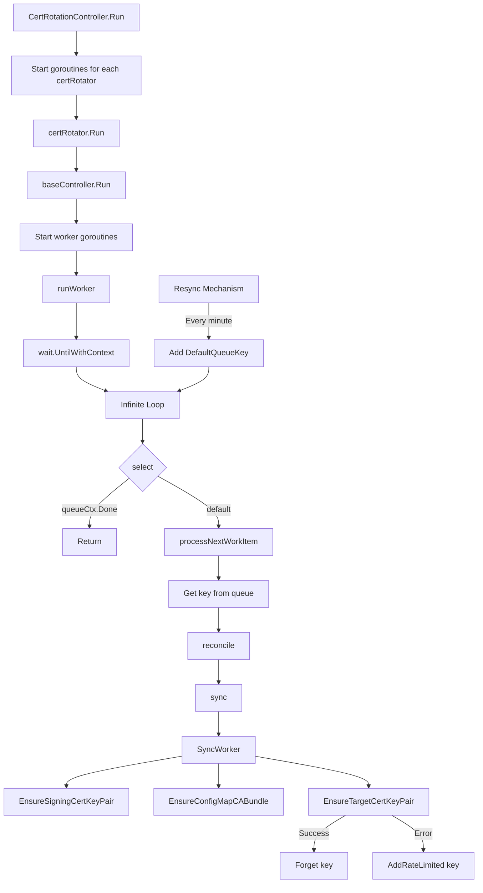

# Certificate Rotation Controller Analysis

## Overview

This document analyzes the internal loop mechanism of the certificate rotation controller in the OpenShift Kubernetes API server operator. The analysis focuses on how the controller manages certificate rotation, particularly for the "KubeAPIServerToKubeletClientCert" rotation.


## Flowchart



The diagram shows:
1. Controller initialization and goroutine creation
2. The core infinite loop with queue processing
3. Certificate rotation workflow (3 key steps)
4. Error handling and requeue logic
5. Periodic resync mechanism


## Controller Structure

The certificate rotation process is managed by the `CertRotationController` in `pkg/operator/certrotationcontroller/certrotationcontroller.go`. This controller creates and manages multiple certificate rotators, each responsible for rotating specific certificates.

## Initialization Flow

1. The `CertRotationController` is created with multiple certificate rotators:
```go
certRotator = certrotation.NewCertRotationController(
    "KubeAPIServerToKubeletClientCert",
    certrotation.RotatedSigningCASecret{...},
    certrotation.CABundleConfigMap{...},
    certrotation.RotatedSelfSignedCertKeySecret{...},
    eventRecorder,
    &certrotation.StaticPodConditionStatusReporter{OperatorClient: operatorClient},
)
```

2. Each rotator is added to the controller's list:
   ```go
   ret.certRotators = append(ret.certRotators, certRotator)
   ```

## Execution Flow

When the controller is run, it starts each certificate rotator in a separate goroutine:

```go
func (c *CertRotationController) Run(ctx context.Context, workers int) {
    // ...
    for _, certRotator := range c.certRotators {
        go certRotator.Run(ctx, workers)
    }
    // ...
}
```

## Internal Loop Mechanism

The internal loop that handles certificate rotation is implemented in the factory controller pattern in the OpenShift library-go package. Here's how it works:

1. Each `certRotator.Run(ctx, workers)` call executes the `baseController.Run` method from `vendor/github.com/openshift/library-go/pkg/controller/factory/base_controller.go`:

    ```go
    func (c *baseController) Run(ctx context.Context, workers int) {
        // ...
        for i := 1; i <= workers; i++ {
            workerWg.Add(1)
            go func() {
                defer workerWg.Done()
                c.runWorker(queueContext)
            }()
        }
        // ...
    }
    ```

2. The `runWorker` method in `vendor/github.com/openshift/library-go/pkg/controller/factory/base_controller.go` contains the actual internal loop:

    ```go
    func (c *baseController) runWorker(queueCtx context.Context) {
        wait.UntilWithContext(
            queueCtx,
            func(queueCtx context.Context) {
                defer utilruntime.HandleCrash(c.degradedPanicHandler)
                for {
                    select {
                    case <-queueCtx.Done():
                        return
                    default:
                        c.processNextWorkItem(queueCtx)
                    }
                }
            },
            1*time.Second)
    }
    ```

3. The `processNextWorkItem` method in `vendor/github.com/openshift/library-go/pkg/controller/factory/base_controller.go` gets an item from the queue and processes it:

   ```go
   func (c *baseController) processNextWorkItem(queueCtx context.Context) {
       key, quit := c.syncContext.Queue().Get()
       if quit {
           return
       }
       defer c.syncContext.Queue().Done(key)
       
       // ...
       
       if err := c.reconcile(queueCtx, syncCtx); err != nil {
           // Handle error and requeue if needed
           c.syncContext.Queue().AddRateLimited(key)
           return
       }
       
       c.syncContext.Queue().Forget(key)
   }
   ```

4. The `reconcile` method calls the `sync` method, which for the certificate rotator calls `SyncWorker` from `vendor/github.com/openshift/library-go/pkg/operator/certrotation/client_cert_rotation_controller.go`:

   ```go
   func (c CertRotationController) Sync(ctx context.Context, syncCtx factory.SyncContext) error {
       syncErr := c.SyncWorker(ctx)
       // ...
       return syncErr
   }
   ```

5. The `SyncWorker` method in `vendor/github.com/openshift/library-go/pkg/operator/certrotation/client_cert_rotation_controller.go` performs the actual certificate rotation:

   ```go
   func (c CertRotationController) SyncWorker(ctx context.Context) error {
       signingCertKeyPair, err := c.RotatedSigningCASecret.EnsureSigningCertKeyPair(ctx)
       if err != nil {
           return err
       }
       
       cabundleCerts, err := c.CABundleConfigMap.EnsureConfigMapCABundle(ctx, signingCertKeyPair)
       if err != nil {
           return err
       }
       
       if _, err := c.RotatedSelfSignedCertKeySecret.EnsureTargetCertKeyPair(ctx, signingCertKeyPair, cabundleCerts); err != nil {
           return err
       }
       
       return nil
   }
   ```

## Resync Mechanism

The controller also has a resync mechanism that adds items to the queue periodically in `vendor/github.com/openshift/library-go/pkg/controller/factory/base_controller.go`:

```go
if c.resyncEvery > 0 {
    workerWg.Add(1)
    go func() {
        defer workerWg.Done()
        wait.UntilWithContext(ctx, func(ctx context.Context) { 
            c.syncContext.Queue().Add(DefaultQueueKey) 
        }, c.resyncEvery)
    }()
}
```

By default, this resync happens every minute, ensuring certificates are checked regularly and rotated when needed based on their validity periods and refresh settings.

## Certificate Rotation Process

During each iteration of the loop, the certificate rotation process follows these steps:

1. **EnsureSigningCertKeyPair**: Ensures the signing CA certificate and key pair are valid and creates/rotates them if needed.
2. **EnsureConfigMapCABundle**: Updates the CA bundle config map with the current signing CA certificate.
3. **EnsureTargetCertKeyPair**: Ensures the target certificate and key pair are valid and creates/rotates them if needed.

## Conclusion

The certificate rotation controller uses a queue-based worker pattern with an internal for loop to continuously check and rotate certificates as needed. The loop runs until the context is cancelled, and certificates are rotated based on their validity periods and refresh settings.
