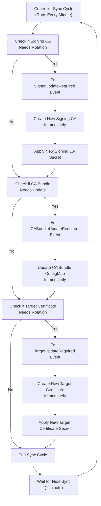
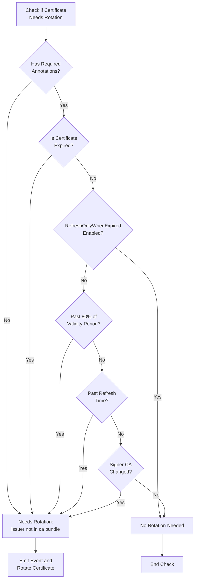

# OpenShift Certificate Rotation Process Summary

This document summarizes how certificate rotation works in OpenShift, with special focus on the timing between event emission and actual certificate updates.

## Certificate Rotation Overview

The certificate rotation controller in OpenShift is responsible for:

1. Creating and maintaining self-signed CA certificates
2. Maintaining CA bundle ConfigMaps with all non-expired CA certificates
3. Creating and rotating target certificates signed by the latest signing CA

The controller runs every minute to check if any certificates need rotation.

## Certificate Rotation Triggers

Certificates are rotated when any of these conditions are met:

- The certificate has already expired
- The certificate has reached 80% of its validity period (if `RefreshOnlyWhenExpired` is false)
- The certificate has passed its configured refresh time (if set)
- The signing CA has changed

## Timing Between Events and Certificate Updates

**Key Finding**: Certificate rotation events and actual certificate updates occur immediately within the same controller cycle:

1. The controller runs checks every minute
2. When a certificate needs rotation, an event (e.g., `SignerUpdateRequired`) is emitted
3. In the same function call, a new certificate is immediately created and applied
4. There is no delay between event emission and certificate update - they are atomic operations

## Certificate Rotation Process Flow

## Certificate Rotation Decision Logic

## System Outputs

During certificate rotation, the system outputs:

### Events

- **SignerUpdateRequired**: Emitted when a new signing certificate/key pair is needed
- **TargetUpdateRequired**: Emitted when a new target certificate/key pair is needed
- **CABundleUpdateRequired**: Emitted when the CA bundle needs to be updated
- **RotationError**: Emitted when an error occurs during rotation

### Logs

The system logs detailed information about certificate updates using klog, for example, when updating the CA bundle it logs: `Updated ca-bundle.crt configmap %s/%s with:\n%s`.

### Status Conditions

If errors occur during the certificate rotation process, the system updates the **CertRotationDegraded** status condition and sets the reason to **RotationError**.

When the status is successfully updated and there are errors, the system records a warning event: **RotationError**, containing the error information.

## Conclusion

The certificate rotation process in OpenShift is designed to be proactive and immediate. When the system detects that a certificate needs rotation, it emits an event and immediately performs the rotation in the same controller cycle. This ensures that certificates are rotated well before they expire, maintaining the security and availability of the cluster.
