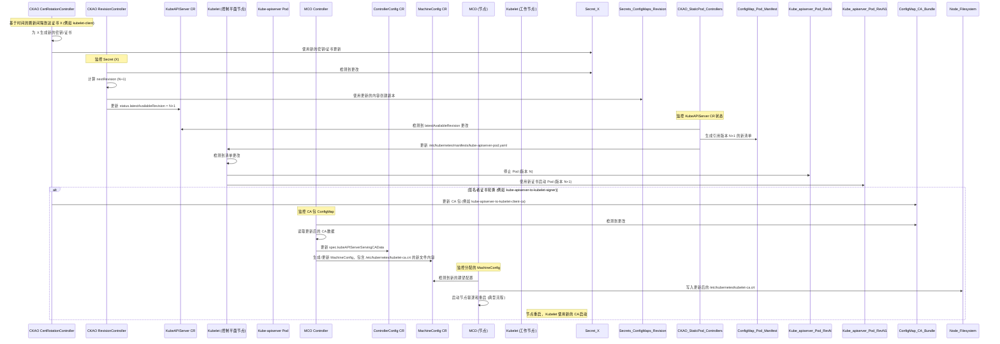

# OpenShift 中 Kube-apiserver 证书轮换分析

本文档分析了 OpenShift 集群中与 Kubernetes API 服务器 (`kube-apiserver`) 相关的证书轮换时触发的流程。详细说明了涉及的组件、存储位置、Machine Config Operator (MCO) 的作用，以及 `kube-apiserver` 和 `kubelet` 的重启行为。

## 概述

`kube-apiserver` 的证书轮换涉及几个关键的 Operator 和 Controller：

1.  **Cluster Kube API Server Operator (CKAO):** 管理 `kube-apiserver` 静态 Pod 及其关联证书（服务证书、客户端证书如 kubelet-client、aggregator-client 等）。它利用 `library-go/operator/certrotation` 库进行基于时间的轮换。
2.  **RevisionController (位于 CKAO/library-go 内):** 监控 `kube-apiserver` 静态 Pod 使用的 ConfigMap 和 Secret。当这些资源因证书轮换或配置更新而更改时，它会创建一个新版本 (revision) 并更新 `KubeAPIServer` 自定义资源 (CR) 的状态。
3.  **Static Pod Controllers (位于 CKAO/library-go 内):** 检测 `KubeAPIServer` CR 状态中的版本变化，并将新的静态 Pod 清单 (manifest) 推送至控制平面节点，通过 Kubelet 触发 `kube-apiserver` 重启。
4.  **Machine Config Operator (MCO):** 监控某些集群范围的配置，包括 Kubelet 用于验证 `kube-apiserver` 的 CA 包 (`kube-apiserver-to-kubelet-client-ca`)。它生成反映所需节点状态的 `MachineConfig` 对象。
5.  **Machine Config Daemon (MCD):** 在每个节点上运行，应用 `MachineConfig` 更改，包括将更新后的 CA 包写入节点的文件系统。应用重大更改通常涉及节点驱逐 (draining) 和重启 (rebooting)。

## 证书轮换触发器和流程 (CKAO)

CKAO 管理 `kube-apiserver` 所需的各种证书的生命周期。

*   **触发器:** 轮换主要是基于时间的，在 CKAO 的 `certrotationcontroller` 中配置。每种证书类型（签名者或目标证书）都有定义的 `Validity` (有效期) 和 `Refresh` (刷新) 周期。当证书的年龄超过其 `Refresh` 持续时间时，轮换过程开始。

    ```go
    // pkg/operator/certrotationcontroller/certrotationcontroller.go
    // KubeAPIServerToKubeletClientCert 目标证书示例:
    certrotation.RotatedSelfSignedCertKeySecret{
        Namespace: operatorclient.TargetNamespace,
        Name:      "kubelet-client",
        // ... 其他字段 ...
        Validity:               30 * rotationDay, // 例如 30 天
        Refresh:                15 * rotationDay, // 例如 15 天
        RefreshOnlyWhenExpired: refreshOnlyWhenExpired,
        CertCreator: &certrotation.ClientRotation{
            UserInfo: &user.DefaultInfo{Name: "system:kube-apiserver", Groups: []string{"kube-master"}},
        },
        // ... informer/client 配置 ...
    },
    ```

*   **流程:** `library-go/pkg/operator/certrotation` 逻辑处理实际的轮换：
    1.  根据证书的颁发日期和配置的 `Refresh` 周期，检查当前目标证书是否需要刷新。
    2.  如果需要刷新，确保证书对应的 *签名者* 证书（在 `RotatedSigningCASecret` 中定义）有效并已加载。
    3.  根据 `CertCreator
    4.  使用签名者证书和密钥签署 CSR，创建新的目标证书。
    5.  将新的密钥和证书保存到目标 Secret 中（例如 `openshift-kube-apiserver` 命名空间中的 `kubelet-client`）。
    6.  如果 *签名者* 证书本身被轮换，则相应的 CA 包 ConfigMap（例如 `openshift-kube-apiserver-operator` 中的 `kube-apiserver-to-kubelet-client-ca`）会被更新以包含新的 CA 证书。

*   **存储:**
    *   **签名者证书/密钥:** 存储在 CKAO 的命名空间 (`openshift-kube-apiserver-operator`) 内的 Secret 中，例如 `kube-apiserver-to-kubelet-signer`。
    *   **目标证书/密钥:** 存储在操作数 (operand) 的命名空间 (`openshift-kube-apiserver`) 内的 Secret 中，例如 `kubelet-client`, `localhost-serving-cert-certkey`。
    *   **CA 包:** 存储在 ConfigMap 中，通常在 CKAO 的命名空间 (`openshift-kube-apiserver-operator`) 或 `openshift-config-managed` 中，例如 `kube-apiserver-to-kubelet-client-ca`, `kube-apiserver-aggregator-client-ca`。

## Kube-apiserver 重启流程 (CKAO)

当 `kube-apiserver` 静态 Pod 直接使用的证书被轮换（在其 Secret 中更新）时，`RevisionController` 会触发重启。

*   **触发器:** `RevisionController` 监控的任何 ConfigMap 或 Secret 中检测到更改。这包括包含已轮换证书的 Secret，如 `kubelet-client`, `localhost-serving-cert-certkey`, `aggregator-client` 等。

*   **流程:**
    1.  `RevisionController.sync` 循环调用 `isLatestRevisionCurrent`。
    2.  `isLatestRevisionCurrent` 将基础 Secrets/ConfigMaps 中的数据（例如 `secrets/kubelet-client`）与最新版本化副本中的数据（例如 `secrets/kubelet-client-3`）进行比较。如果证书轮换更新了基础 Secret，则会检测到差异。
    3.  调用 `createRevisionIfNeeded`，确定一个新的版本号 (`nextRevision = latestAvailableRevision + 1`)。
    4.  `createNewRevision` 将基础 Secrets/ConfigMaps 的 *当前* 内容复制到带有 `nextRevision` 后缀的新 Secrets/ConfigMaps 中（例如 `secrets/kubelet-client-4`）。
    5.  关键步骤：`createRevisionIfNeeded` 通过 `operatorClient.UpdateLatestRevisionOperatorStatus` 调用更新 `KubeAPIServer` CR 中的 `status.latestAvailableRevision` 字段。
    6.  CKAO 中的其他控制器（静态 Pod 管理框架的一部分，如 `InstallerController`, `NodeController`）监控 `KubeAPIServer` CR。它们检测到 `status.latestAvailableRevision` 的变化。
    7.  `InstallerController`（很可能）生成一个新的 `kube-apiserver` 静态 Pod 清单 (`pod.yaml`)，该清单引用 `nextRevision`。此清单以及其他版本化资源被放入特定于版本的 ConfigMap 中（例如 `kube-apiserver-pod-4`）。
    8.  `NodeController` 确保此 ConfigMap 被挂载到每个控制平面节点上的正确目录 (`/etc/kubernetes/static-pod-resources/kube-apiserver-pod-<revision>`)，并更新静态 Pod 清单文件 (`/etc/kubernetes/manifests/kube-apiserver-pod.yaml`) 以指向新版本的清单。
    9.  控制平面节点上的 Kubelet 监视 `/etc/kubernetes/manifests` 目录。检测到 `kube-apiserver-pod.yaml` 的更改后，它会优雅地停止旧的 `kube-apiserver` 静态 Pod，并根据更新后的清单启动一个新的 Pod，该清单使用包含已轮换证书的新版本化 Secrets/ConfigMaps。

*   **代码片段 (版本触发器):**

    ```go
    // vendor/github.com/openshift/library-go/pkg/operator/revisioncontroller/revision_controller.go

    // isLatestRevisionCurrent 比较基础资源与最新版本化副本。
    func (c RevisionController) isLatestRevisionCurrent(ctx context.Context, revision int32) (bool, bool, string) {
        // ... configmap 和 secret 的比较逻辑 ...
        if !equality.Semantic.DeepEqual(existingData, requiredData) {
            // 检测到差异
            return false, false, "resource changed"
        }
        // ...
        return true, false, ""
    }

    // createRevisionIfNeeded 如果检测到更改，则创建新版本。
    func (c RevisionController) createRevisionIfNeeded(ctx context.Context, recorder events.Recorder, latestAvailableRevision int32, resourceVersion string) (bool, error) {
        isLatestRevisionCurrent, requiredIsNotFound, reason := c.isLatestRevisionCurrent(ctx, latestAvailableRevision)
        if isLatestRevisionCurrent {
            return false, nil // 没有变化
        }

        nextRevision := latestAvailableRevision + 1
        // ... 检查所需资源 ...

        // 创建新的版本化资源副本
        createdNewRevision, err := c.createNewRevision(ctx, recorder, nextRevision, reason)
        // ... 错误处理 ...

        if !createdNewRevision { return false, nil }

        // *** 关键步骤：使用新的版本号更新 Operator 状态 ***
        cond := operatorv1.OperatorCondition{ /* ... */ }
        if _, updated, updateError := c.operatorClient.UpdateLatestRevisionOperatorStatus(ctx, nextRevision, v1helpers.UpdateConditionFn(cond)); updateError != nil {
            return true, updateError
        } else if updated {
            recorder.Eventf("RevisionCreate", "Revision %d created because %s", nextRevision, reason)
        }
        return false, nil
    }
    ```

## CA 包分发 (MCO/MCD)

当静态 Pod 外部组件（如 Kubelet）使用的 CA 包更新时，MCO 和 MCD 处理其到节点的分发。主要示例是 Kubelet 用于验证 `kube-apiserver` 服务证书的 CA 包。

*   **触发器:** 当相应的 *签名者* 证书轮换时，CKAO 的 `CertRotationController` 更新 CA 包 ConfigMap（例如 `openshift-kube-apiserver-operator` 中的 `kube-apiserver-to-kubelet-client-ca`）。
*   **组件:** MCO Controller, MCD (Machine Config Daemon)。
*   **流程:**
    1.  MCO 控制器 (`pkg/operator/sync.go`) 监视相关的 ConfigMap，包括 `kube-apiserver-to-kubelet-client-ca`。
    2.  检测到更改后，它会读取更新后的 CA 包数据 (`ca-bundle.crt`)。
    3.  此数据 (`kubeAPIServerServingCABytes`) 存储在 MCO 内部的 `ControllerConfig` CR 规范 (`spec.KubeAPIServerServingCAData`) 中。
    4.  MCO 为相关池（例如 `master`, `worker`）渲染新的 `MachineConfig` 对象。这些 `MachineConfig` 定义了节点上文件的所需状态，包括 Kubelet CA 包的目标路径，并使用 `spec.KubeAPIServerServingCAData` 中的数据填充。
    5.  在每个节点上运行的 MCD 检测到有新的 `MachineConfig` 可用。
    6.  MCD 的 `certificate_writer.go` 专门处理将应用的 `ControllerConfig` 的 `Spec.KubeAPIServerServingCAData` 中的 CA 数据写入节点文件系统上的指定路径。

*   **存储:** CA 包由 MCD 写入节点文件系统。Kubelet 的 `--client-ca-file` 参数（或相应的 KubeletConfiguration 字段 `clientCAFile`）使用的典型路径是 `/etc/kubernetes/kubelet-ca.crt`。

*   **代码片段:**

    ```go
    // pkg/operator/sync.go - MCO 读取 CA 包 ConfigMap
    func (optr *Operator) sync(ctx context.Context, syncCtx factory.SyncContext) error {
        // ... 其他逻辑 ...
        var kubeAPIServerServingCABytes []byte
        // ... 根据认证模式确定读取哪个 CM 的逻辑 ...
        kubeAPIServerServingCABytes, err = optr.getCAsFromConfigMap("openshift-kube-apiserver-operator", "kube-apiserver-to-kubelet-client-ca", "ca-bundle.crt")
        // ... 错误处理和合并逻辑 ...

        // 存储在 ControllerConfig 规范中
        spec.KubeAPIServerServingCAData = kubeAPIServerServingCABytes
        // ... 使用此数据渲染 MachineConfigs ...
    }

    // pkg/daemon/certificate_writer.go - MCD 将 CA 包写入节点
    func (cw *CertificateWriter) writeCertificatesToDisk() error {
        // ... 获取 controllerConfig ...
        kubeAPIServerServingCABytes := controllerConfig.Spec.KubeAPIServerServingCAData
        // ... 其他 CA ...

        pathToData := make(map[string][]byte)
        // 假设 caBundleFilePath 解析为 /etc/kubernetes/kubelet-ca.crt 或类似路径
        pathToData[caBundleFilePath] = kubeAPIServerServingCABytes
        // ... 将其他 CA 添加到 pathToData ...

        // 写入 pathToData 中定义的文件
        if err := cw.writeFiles(pathToData); err != nil {
            return fmt.Errorf("error writing certificate files: %w", err)
        }
        // ... 可能重启服务 ...
        return nil
    }
    ```

## Kubelet 重启流程

Kubelet 是否会因 CA 包更新而 *直接* 重启，情况比较微妙。

*   **触发器:** MCD 将新的 `MachineConfig` 应用到节点。此 `MachineConfig` 可能包含更新后的 `/etc/kubernetes/kubelet-ca.crt` 文件内容，或其他对 Kubelet 配置或相关系统文件的更改。
*   **流程:**
    1.  Kubelet 通常能够重新加载 TLS 资产（如 `clientCAFile`）而无需完全重启服务。它会定期检查文件更改或可以被触发重新加载。
    2.  然而，通过 MCD 应用 `MachineConfig` 更改的标准机制，特别是对于核心组件或关键文件路径，涉及协调的节点更新过程。
    3.  MCD 通常会 **驱逐 (drain)** 节点（移除 Pod），然后 **重启 (reboot)** 节点，以确保所有更改都干净、一致地应用。此重启会固有地重启 Kubelet 服务以及整个节点操作系统。
    4.  虽然 MCD 代码 (`pkg/daemon/certificate_writer.go`) 中包含提及 `"Skipping kubelet restart"` 的逻辑，但这可能适用于特定的、非破坏性的场景，或者可能与在复杂更新期间延迟重启有关。应用包含新 CA 包的 `MachineConfig` 更改的默认且最安全机制是由 MCD 协调的节点重启。

*   **关于 Kubelet 重启的结论:** Kubelet *服务* 重启 (`systemctl restart kubelet`) **并非由** CKAO 轮换 `kube-apiserver-to-kubelet-client-ca` **直接触发**。相反，更新是通过 `MachineConfig` 传递的，而 MCD 应用此 `MachineConfig` **通常会导致节点重启**，从而间接重启 Kubelet。如果仅文件内容发生更改，Kubelet 进程本身很可能重新加载更新后的 CA 文件内容而无需服务重启，但 MCO/MCD 更新机制通常涉及对此类更改进行重启。

## 时序图



## 总结

*   **证书轮换触发器:** CKAO 中配置的基于时间的刷新间隔。
*   **组件:** CKAO (`CertRotationController`, `RevisionController`, Static Pod Controllers), MCO, MCD, Kubelet。
*   **证书存储:** `openshift-kube-apiserver-operator` 和 `openshift-kube-apiserver` 命名空间中的 Secret 和 ConfigMap。CA 包也由 MCD 写入节点的 `/etc/kubernetes/kubelet-ca.crt`。
*   **Kube-apiserver 重启:** 由 CKAO 的 `RevisionController` 检测到依赖的 Secrets/ConfigMaps（包括轮换的证书）发生更改而触发。CKAO 更新 `KubeAPIServer` CR 状态 (`latestAvailableRevision`)，导致由控制平面节点上的 Kubelet 管理的静态 Pod 推送 (rollout)。
*   **Kubelet 重启:** 不是由 CA 包轮换直接触发。MCO 检测到更新的 CA 包 ConfigMap，生成新的 `MachineConfig`，然后 MCD 将此更改应用到节点。应用 `MachineConfig` 通常涉及节点驱逐和 **重启**，这会间接重启 Kubelet。
