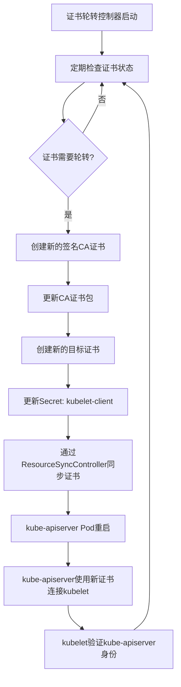

# Kubernetes API Server到Kubelet的证书轮转流程

本文档详细说明了Kubernetes API Server与Kubelet之间的证书轮转流程，包括证书的创建、更新、分发以及Kubelet重新部署的过程。

## 1. 证书轮转概述

在Kubernetes集群中，kube-apiserver需要与各节点上的kubelet进行安全通信。这种通信通过TLS加密，并使用客户端证书进行身份验证。`KubeAPIServerToKubeletClientCert`是kube-apiserver用来向kubelet进行身份验证的客户端证书。

证书轮转是一个自动化过程，确保证书在过期前被更新，从而保持集群的安全性和可用性。

## 2. 证书轮转流程



## 3. 详细流程解析

### 3.1 证书创建和轮转

证书轮转从`CertRotationController`开始，它负责管理多个证书轮转器，包括`KubeAPIServerToKubeletClientCert`。

```go
certRotator = certrotation.NewCertRotationController(
    "KubeAPIServerToKubeletClientCert",
    certrotation.RotatedSigningCASecret{
        Namespace: operatorclient.OperatorNamespace,
        Name:      "kube-apiserver-to-kubelet-signer",
        AdditionalAnnotations: certrotation.AdditionalAnnotations{
            JiraComponent: "kube-apiserver",
        },
        Validity: 1 * 365 * defaultRotationDay, // 有效期为1年
        Refresh:  292 * defaultRotationDay,     // 约80%的有效期后刷新
        RefreshOnlyWhenExpired: refreshOnlyWhenExpired,
        Informer:               kubeInformersForNamespaces.InformersFor(operatorclient.OperatorNamespace).Core().V1().Secrets(),
        Lister:                 kubeInformersForNamespaces.InformersFor(operatorclient.OperatorNamespace).Core().V1().Secrets().Lister(),
        Client:                 kubeClient.CoreV1(),
        EventRecorder:          eventRecorder,
        UseSecretUpdateOnly:    true,
    },
    // ... 其他配置 ...
)
```

证书轮转过程包括三个主要步骤：

1. **EnsureSigningCertKeyPair**: 确保签名CA证书和密钥对有效，如果需要则创建或轮转它们。
2. **EnsureConfigMapCABundle**: 使用当前签名CA证书更新CA证书包配置映射。
3. **EnsureTargetCertKeyPair**: 确保目标证书和密钥对有效，如果需要则创建或轮转它们。

当证书需要轮转时（例如，达到了刷新时间或已过期），控制器会：
1. 创建新的签名CA证书
2. 更新CA证书包
3. 使用新的签名CA创建新的目标证书

### 3.2 证书分发机制

证书创建后，通过`ResourceSyncController`进行分发。这个控制器负责将证书从源位置同步到目标位置。

在`ManageClientCABundle`函数中，我们可以看到证书是如何被组合和分发的：

```go
func ManageClientCABundle(ctx context.Context, lister corev1listers.ConfigMapLister, client coreclientv1.ConfigMapsGetter, recorder events.Recorder) (*corev1.ConfigMap, bool, error) {
    requiredConfigMap, err := resourcesynccontroller.CombineCABundleConfigMaps(
        resourcesynccontroller.ResourceLocation{Namespace: operatorclient.TargetNamespace, Name: "client-ca"},
        lister,
        certrotation.AdditionalAnnotations{
            JiraComponent: "kube-apiserver",
        },
        // ... 其他CA证书来源 ...
        // 这个bundle用于验证kube-apiserver与kubelet的通信
        resourcesynccontroller.ResourceLocation{Namespace: operatorclient.OperatorNamespace, Name: "kube-apiserver-to-kubelet-client-ca"},
        // ... 其他CA证书来源 ...
    )
    // ... 应用配置映射 ...
}
```

### 3.3 kubelet-client 证书的更新机制

当新的 `kubelet-client` 证书被创建并存储在 Secret 中后，它不会直接触发 Kubernetes CSR（证书签名请求）机制。相反，证书轮转控制器直接生成新的证书，并将其存储在 Secret 中。kube-apiserver Pod 重启时（由于配置更改或手动触发），会加载新的证书，并使用这个新证书与 kubelet 通信。

### 3.4 Kubelet 如何验证 kube-apiserver 的证书

kubelet 不需要重新部署来接受新的 kube-apiserver 证书。这是因为：

1.  这个证书是 kube-apiserver 用来向 kubelet 进行身份验证的客户端证书。
2.  kubelet 验证 kube-apiserver 提供的证书是否由其信任的 CA 签名。  kubelet 通过 `--kubelet-client-ca` 标志指定的 CA 证书文件来验证 kube-apiserver 的客户端证书。这个 CA 证书包通常在集群设置期间分发到各个节点。

当 kube-apiserver 使用新证书连接到 kubelet 时，只要该证书由 kubelet 信任的 CA 签名，kubelet 就会接受连接。这种设计使得证书轮转对 kubelet 透明，不需要重启或重新部署 kubelet。

Cluster Version Operator (CVO) 似乎负责 kubernetes-client-ca.crt 的轮替。


## 4. 证书检查和轮转决策

证书轮转控制器使用以下逻辑来决定何时轮转证书：

```go
func needNewTargetCertKeyPairForTime(annotations map[string]string, signer *crypto.CA, refresh time.Duration, refreshOnlyWhenExpired bool) string {
    notBefore, notAfter, reason := getValidityFromAnnotations(annotations)
    if len(reason) > 0 {
        return reason
    }

    // 证书是否已过期?
    if time.Now().After(notAfter) {
        return "already expired"
    }

    if refreshOnlyWhenExpired {
        return ""
    }

    // 是否达到了80%的有效期?
    validity := notAfter.Sub(notBefore)
    at80Percent := notAfter.Add(-validity / 5)
    if time.Now().After(at80Percent) {
        return fmt.Sprintf("past its latest possible time %v", at80Percent)
    }

    // 是否超过了刷新时间?
    refreshTime := notBefore.Add(refresh)
    if time.Now().After(refreshTime) {
        // 确保签名者已经有效足够长的时间
        timeToWaitForTrustRotation := refresh / 10
        if time.Now().After(signer.Config.Certs[0].NotBefore.Add(time.Duration(timeToWaitForTrustRotation))) {
            return fmt.Sprintf("past its refresh time %v", refreshTime)
        }
    }

    return ""
}
```

## 5. CA证书轮转机制

CA证书（签名证书）本身也有有效期限制，并且也会自动轮转。从代码中可以看到，`kube-apiserver-to-kubelet-signer` CA证书的配置如下：

```go
certrotation.RotatedSigningCASecret{
    Namespace: operatorclient.OperatorNamespace,
    Name:      "kube-apiserver-to-kubelet-signer",
    AdditionalAnnotations: certrotation.AdditionalAnnotations{
        JiraComponent: "kube-apiserver",
    },
    Validity: 1 * 365 * defaultRotationDay, // 有效期为1年
    Refresh:  292 * defaultRotationDay,     // 约80%的有效期后刷新
    RefreshOnlyWhenExpired: refreshOnlyWhenExpired,
    // ...
}
```

CA证书的有效期设置为1年，并且会在其有效期的约80%（292天）时进行刷新。这意味着CA证书本身也会在过期前自动轮转。

当CA证书轮转时，会发生以下过程：

1. 创建新的CA证书和密钥对
2. 将新的CA证书添加到CA证书包中
3. 旧的CA证书保留在证书包中，直到它过期
4. 新的目标证书将使用新的CA证书进行签名

这种机制确保了在CA证书轮转期间有一个平滑的过渡期，在此期间新旧CA证书都被信任。这允许使用新CA签名的证书逐步推出，而不会中断服务。

### 5.1 CA证书包管理

CA证书包的管理是通过`CombineCABundleConfigMaps`函数实现的：

```go
func CombineCABundleConfigMaps(destinationConfigMap ResourceLocation, lister corev1listers.ConfigMapLister, additionalAnnotations certrotation.AdditionalAnnotations, inputConfigMaps ...ResourceLocation) (*corev1.ConfigMap, error) {
    certificates := []*x509.Certificate{}
    // 收集所有输入配置映射中的证书
    for _, input := range inputConfigMaps {
        // ... 获取和解析证书 ...
        certificates = append(certificates, inputCerts...)
    }

    // 过滤掉过期的证书
    certificates = crypto.FilterExpiredCerts(certificates...)
    
    // 去除重复的证书
    finalCertificates := []*x509.Certificate{}
    // ... 去重逻辑 ...

    // 编码证书并创建配置映射
    caBytes, err := crypto.EncodeCertificates(finalCertificates...)
    // ... 创建配置映射 ...
    
    return cm, nil
}
```

这个函数确保：
1. 收集所有相关的CA证书
2. 过滤掉已过期的证书
3. 去除重复的证书
4. 将有效的证书编码并存储在配置映射中

通过这种方式，系统可以自动管理CA证书的生命周期，包括添加新的CA证书和移除过期的CA证书。

## 6. 总结

kube-apiserver到kubelet的证书轮转是一个自动化过程，确保kube-apiserver可以安全地与集群中的kubelet通信。这个过程包括：

1. 证书轮转控制器定期检查证书状态
2. 当需要时，创建新的签名CA证书和目标证书
3. 通过ResourceSyncController将证书分发到适当的位置
4. kube-apiserver重启后使用新证书
5. kubelet验证kube-apiserver提供的证书

这个过程对kubelet是透明的，不需要重启或重新部署kubelet。整个流程确保了集群组件之间的通信安全性和可用性。
