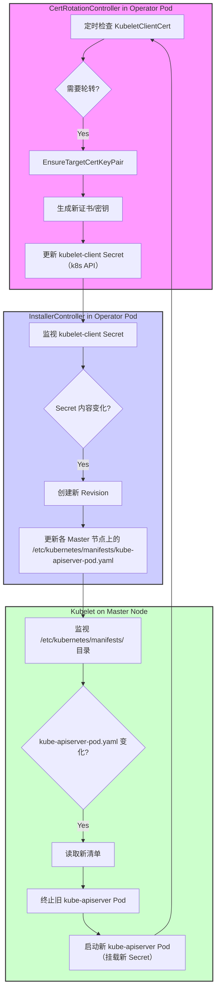

# kubelet-client 证书更新触发 kube-apiserver 重启的详细流程

## 1. 背景

在 OpenShift 集群中，`cluster-kube-apiserver-operator` 负责管理 `kube-apiserver` 的生命周期，包括其配置和相关证书。其中，`kubelet-client` 证书用于 `kube-apiserver` 向 `kubelet` 发起请求时的身份验证。该证书由 `CertRotationController` 自动轮转。一个常见的观察现象是，当 `kubelet-client` 证书更新时，`kube-apiserver` 的 Pod 会发生重启。本文档旨在详细解释这一过程背后的逻辑流和关键代码路径。

## 2. 核心组件

参与此流程的关键组件包括：

*   **CertRotationController**: `library-go` 库提供的通用控制器，用于管理证书的自动轮转。在 `cluster-kube-apiserver-operator` 中，它被配置用来管理 `kubelet-client` 等证书。
*   **kubelet-client Secret**: 存储 `kube-apiserver` 用于连接 `kubelet` 的客户端证书和私钥。位于 `openshift-kube-apiserver` 命名空间。
*   **InstallerController**: `library-go` 库提供的静态 Pod 控制器。`cluster-kube-apiserver-operator` 使用它来管理 `kube-apiserver` 静态 Pod 的部署和更新。它监视输入资源（如 Secrets、ConfigMaps），并在这些资源变化时触发 Pod 的更新（滚动）。
*   **Kubelet**: 运行在每个 Master 节点上，负责根据 `/etc/kubernetes/manifests/` 目录下的静态 Pod 清单文件来启动和管理 `kube-apiserver` Pod。

## 3. 逻辑流程

以下是 `kubelet-client` 证书更新导致 `kube-apiserver` 重启的详细逻辑步骤：

1.  **证书轮转检查**: `CertRotationController` (在 `cluster-kube-apiserver-operator` Pod 内运行) 定期（默认为每分钟通过 `resync` 机制触发）检查其管理的证书。对于 `kubelet-client` 证书，它会检查是否满足轮转条件（例如，是否到达了预设的 `Refresh` 时间，对于 `kubelet-client` 是 15 天）。
2.  **触发证书更新**: 当满足轮转条件时，`CertRotationController` 的 `SyncWorker` 函数被调用。
3.  **生成新证书**: `SyncWorker` 调用 `RotatedSelfSignedCertKeySecret.EnsureTargetCertKeyPair` 函数。此函数生成一个新的 `kubelet-client` 证书和私钥对。
4.  **更新 Secret**: `EnsureTargetCertKeyPair` 函数随后调用 Kubernetes API，更新 `openshift-kube-apiserver` 命名空间中的 `kubelet-client` Secret 对象，写入新的证书和私钥。
5.  **InstallerController 检测变化**: `InstallerController` (同样在 `cluster-kube-apiserver-operator` Pod 内运行) 监视着 `kube-apiserver` 静态 Pod 所需的输入资源，其中包括 `kubelet-client` Secret。当它检测到 `kubelet-client` Secret 的内容发生变化时，会认为 `kube-apiserver` 的配置需要更新。
6.  **创建新 Revision**: `InstallerController` 创建一个新的部署“修订版本（Revision）”。这通常涉及到创建一个新的 ConfigMap 或 Secret 来代表这个修订版本（例如 `kube-apiserver-pod-5`），并在 Operator 的状态中记录当前的 Revision 编号。
7.  **更新静态 Pod 清单**: `InstallerController` 在每个 Master 节点上更新 `kube-apiserver` 的静态 Pod 清单文件（通常是 `/etc/kubernetes/manifests/kube-apiserver-pod.yaml`）。这个更新后的清单文件会引用新的 Revision 相关的资源（如果适用），并且其自身的元数据（如标签或注解）可能也会改变，以反映新的 Revision。
8.  **Kubelet 检测清单变化**: 运行在 Master 节点上的 Kubelet 会监视 `/etc/kubernetes/manifests/` 目录。当它检测到 `kube-apiserver-pod.yaml` 文件发生变化时，它会读取新的清单。
9.  **触发 Pod 重启**: Kubelet 比较新旧清单。由于清单内容（至少是其标识 Revision 的部分）发生了变化，Kubelet 会优雅地终止旧的 `kube-apiserver` Pod 容器，并根据新的清单文件启动一个新的 `kube-apiserver` Pod 容器。这个新的 Pod 会挂载更新后的 `kubelet-client` Secret。

## 4. 代码流关键点

*   **证书检查与更新**:
    *   `vendor/github.com/openshift/library-go/pkg/operator/certrotation/client_cert_rotation_controller.go`: `CertRotationController.SyncWorker` 是入口点。
    *   `vendor/github.com/openshift/library-go/pkg/operator/certrotation/target.go`: `RotatedSelfSignedCertKeySecret.EnsureTargetCertKeyPair` 负责检查轮转条件 (`needNewTargetCertKeyPairForTime`)、生成新证书 (`crypto.MakeSelfSignedCA`) 并更新 Secret (`v1helpers.ApplySecret`).
*   **静态 Pod 更新触发**:
    *   `vendor/github.com/openshift/library-go/pkg/operator/staticpod/controller/installer/installer_controller.go`: `InstallerController.sync` 是核心逻辑。
    *   `sync` 方法会比较当前实际的 Pod 状态（通过 `podinformer` 获取）和期望的状态（基于输入资源如 `kubelet-client` Secret）。
    *   如果检测到差异（例如 `kubelet-client` Secret 的 `ResourceVersion` 变化），它会调用 `createInstallerPod` 或类似逻辑来创建代表新 Revision 的 Pod（在 Operator 命名空间内，用于将新配置推送到节点）。
    *   同时，它会更新 Operator 的状态，记录新的 `LatestAvailableRevision`。
    *   `NodeState` 的更新会触发对节点上静态 Pod 清单文件的更新。
*   **Kubelet 行为**: Kubelet 对 `/etc/kubernetes/manifests/` 目录的监视和基于文件变化的 Pod 重启是 Kubernetes 的标准行为，不由 Operator 代码直接控制，而是 Kubelet 的内置功能。

## 5. Mermaid 流程图

## 6. 总结

`kubelet-client` 证书更新导致 `kube-apiserver` 重启是一个由 `cluster-kube-apiserver-operator` 精心编排的过程。`CertRotationController` 负责按计划更新 Secret 对象，而 `InstallerController` 则监视这些作为静态 Pod 输入的 Secret。一旦 Secret 发生变化，`InstallerController` 会驱动一个新的 Revision 的部署，通过更新节点上的静态 Pod 清单文件，最终由 Kubelet 执行 Pod 的重启，以确保 `kube-apiserver` 使用最新的配置和凭证。这个机制保证了证书在过期前得到更新，同时也确保了配置变更能够安全、自动地应用到关键的静态 Pod 上。
