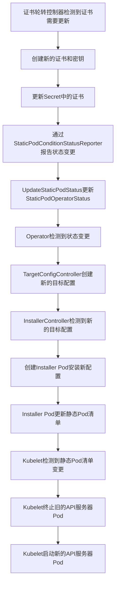

# 证书更新触发API服务器重启的流程

在Kubernetes集群中，证书轮转是一个重要的安全机制，确保通信安全。当证书更新后，需要重启相关组件以应用新证书。本文将详细分析证书更新后触发kube-apiserver重启的代码逻辑和流程。

## 证书轮转控制器概述

证书轮转由`CertRotationController`控制，它负责：

1. 创建自签名CA证书并存储在Secret中
2. 维护包含所有未过期CA证书的ConfigMap
3. 创建由最新签名CA签名的目标证书和密钥，并存储在Secret中

```go
// CertRotationController 执行以下操作:
// 1) 持续创建自签名CA证书 (通过 RotatedSigningCASecret) 并存储在secret中
// 2) 维护一个CA证书包ConfigMap，包含所有未过期的CA证书
// 3) 持续创建由最新签名CA签名的目标证书和密钥，并存储在secret中
type CertRotationController struct {
    // 控制器名称
    Name string
    // RotatedSigningCASecret 轮转存储在secret中的自签名CA
    RotatedSigningCASecret RotatedSigningCASecret
    // CABundleConfigMap 维护CA证书包configmap，通过添加来自rotatedSigningCASecret的新CA证书，并移除过期的旧证书
    CABundleConfigMap CABundleConfigMap
    // RotatedSelfSignedCertKeySecret 轮转由签名CA签名的密钥和证书，并存储在secret中
    RotatedSelfSignedCertKeySecret RotatedSelfSignedCertKeySecret

    // 状态报告器
    StatusReporter StatusReporter
}
```

## 证书更新流程

当证书需要更新时，`CertRotationController`会执行以下步骤：

1. 检查证书是否需要更新（基于有效期、刷新时间等条件）
2. 如果需要更新，创建新的证书和密钥
3. 更新相应的Secret
4. 通过`StaticPodConditionStatusReporter`报告状态变更

```go
func (c CertRotationController) SyncWorker(ctx context.Context) error {
    // 确保签名证书密钥对
    signingCertKeyPair, err := c.RotatedSigningCASecret.EnsureSigningCertKeyPair(ctx)
    if err != nil {
        return err
    }

    // 确保ConfigMap中的CA证书包
    cabundleCerts, err := c.CABundleConfigMap.EnsureConfigMapCABundle(ctx, signingCertKeyPair)
    if err != nil {
        return err
    }

    // 确保目标证书密钥对
    if _, err := c.RotatedSelfSignedCertKeySecret.EnsureTargetCertKeyPair(ctx, signingCertKeyPair, cabundleCerts); err != nil {
        return err
    }

    return nil
}
```

## 状态报告与API服务器重启触发

证书更新后，状态变更通过`StaticPodConditionStatusReporter`报告：

```go
func (s *StaticPodConditionStatusReporter) Report(ctx context.Context, controllerName string, syncErr error) (bool, error) {
    newCondition := operatorv1.OperatorCondition{
        Type:   fmt.Sprintf(condition.CertRotationDegradedConditionTypeFmt, controllerName),
        Status: operatorv1.ConditionFalse,
    }
    if syncErr != nil {
        newCondition.Status = operatorv1.ConditionTrue
        newCondition.Reason = "RotationError"
        newCondition.Message = syncErr.Error()
    }
    _, updated, updateErr := v1helpers.UpdateStaticPodStatus(ctx, s.OperatorClient, v1helpers.UpdateStaticPodConditionFn(newCondition))
    return updated, updateErr
}
```

这个状态更新是触发API服务器重启的关键。当证书更新后，状态变更会通过`UpdateStaticPodStatus`函数更新到`StaticPodOperatorStatus`中。

## API服务器重启流程

证书更新后触发API服务器重启的完整流程如下：



### 关键组件解析

1. **CertRotationController**: 负责证书轮转，当证书需要更新时创建新证书
2. **StaticPodConditionStatusReporter**: 报告证书状态变更
3. **TargetConfigController**: 检测到状态变更后创建新的目标配置
4. **InstallerController**: 负责将新配置安装到节点上
5. **Installer Pod**: 在节点上运行，更新静态Pod清单
6. **Kubelet**: 检测到静态Pod清单变更，重启API服务器Pod

### 重启触发的具体代码路径

1. 证书更新后，`CertRotationController`通过`EnsureTargetCertKeyPair`更新Secret：

```go
func (c RotatedSelfSignedCertKeySecret) EnsureTargetCertKeyPair(ctx context.Context, signingCertKeyPair *crypto.CA, caBundleCerts []*x509.Certificate) (*corev1.Secret, error) {
    // ...
    if reason := c.CertCreator.NeedNewTargetCertKeyPair(targetCertKeyPairSecret, signingCertKeyPair, caBundleCerts, c.Refresh, c.RefreshOnlyWhenExpired); len(reason) > 0 {
        c.EventRecorder.Eventf("TargetUpdateRequired", "%q in %q requires a new target cert/key pair: %v", c.Name, c.Namespace, reason)
        if err := setTargetCertKeyPairSecret(targetCertKeyPairSecret, c.Validity, signingCertKeyPair, c.CertCreator, c.AdditionalAnnotations); err != nil {
            return nil, err
        }
        // ...
        actualTargetCertKeyPairSecret, _, err := applyFn(ctx, c.Client, c.EventRecorder, targetCertKeyPairSecret)
        // ...
    }
    // ...
}
```

2. 证书更新后，状态变更通过`StaticPodConditionStatusReporter.Report`报告：

```go
func (s *StaticPodConditionStatusReporter) Report(ctx context.Context, controllerName string, syncErr error) (bool, error) {
    // ...
    _, updated, updateErr := v1helpers.UpdateStaticPodStatus(ctx, s.OperatorClient, v1helpers.UpdateStaticPodConditionFn(newCondition))
    return updated, updateErr
}
```

3. `TargetConfigController`检测到状态变更，创建新的目标配置：

```go
func createTargetConfig(ctx context.Context, c TargetConfigController, recorder events.Recorder, operatorSpec *operatorv1.StaticPodOperatorSpec) (bool, error) {
    // ...
    _, _, err = managePods(ctx, c.kubeClient.CoreV1(), c.isStartupMonitorEnabledFn, recorder, operatorSpec, c.targetImagePullSpec, c.operatorImagePullSpec)
    // ...
}
```

4. `InstallerController`检测到新的目标配置，创建Installer Pod：

```go
func (c *InstallerController) manageInstallationPods(ctx context.Context, operatorSpec *operatorv1.StaticPodOperatorSpec, originalOperatorStatus *operatorv1.StaticPodOperatorStatus) (bool, time.Duration, error) {
    // ...
    if err := c.ensureInstallerPod(ctx, operatorSpec, currNodeState); err != nil {
        // ...
    }
    // ...
}
```

5. Installer Pod更新静态Pod清单，Kubelet检测到变更并重启API服务器Pod。

## 总结

证书更新触发API服务器重启的核心流程是：

1. 证书轮转控制器检测到证书需要更新，创建新证书
2. 更新Secret中的证书内容
3. 报告状态变更，更新StaticPodOperatorStatus
4. TargetConfigController检测到状态变更，创建新的目标配置
5. InstallerController创建Installer Pod安装新配置
6. Installer Pod更新静态Pod清单
7. Kubelet检测到静态Pod清单变更，重启API服务器Pod

这个流程确保了证书更新后，API服务器能够使用新的证书重新启动，保证集群通信的安全性。
