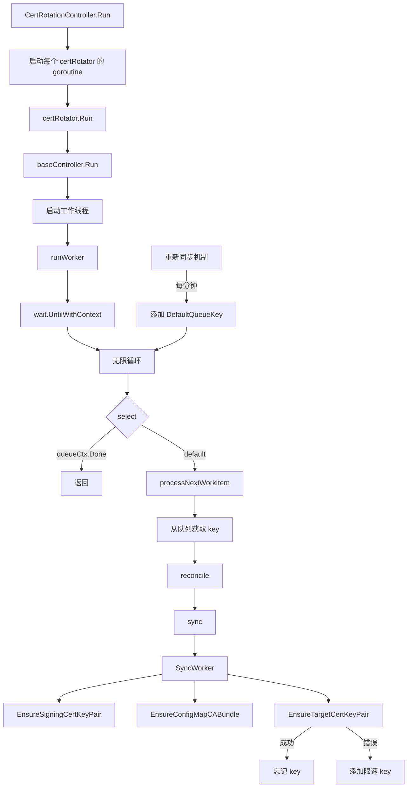
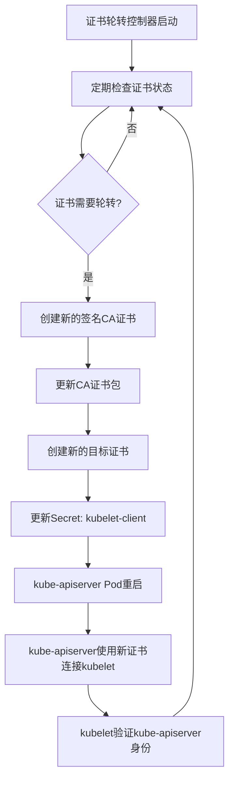

# Kubernetes 证书更替过程与监控方案

openshift 4.14+ 里面，有很多operator管理的tls和CA证书，我们可以用如下命令看到都有些什么

```bash
date
# Tue Apr  1 12:02:49 AM CST 2025

echo -e "NAMESPACE\tNAME\tEXPIRY" && oc get secrets -A -o go-template='{{range .items}}{{if eq .type "kubernetes.io/tls"}}{{.metadata.namespace}}{{" "}}{{.metadata.name}}{{" "}}{{index .data "tls.crt"}}{{"\n"}}{{end}}{{end}}' | while read namespace name cert; do echo -en "$namespace\t$name\t"; echo $cert | base64 -d | openssl x509 -noout -enddate; done | column -t
# NAMESPACE       NAME    EXPIRY
# demo-keycloak                                     example-tls-secret                                  notAfter=Feb  21  14:50:50  2026  GMT
# group-sync-operator                               group-sync-operator-certs                           notAfter=Dec  19  09:40:22  2026  GMT
# istio-system                                      knative-serving-cert                                notAfter=Oct  20  02:55:08  2026  GMT
# knative-serving                                   activator-sm-service-tls                            notAfter=Dec  6   03:32:27  2026  GMT
# knative-serving                                   autoscaler-hpa-sm-service-tls                       notAfter=Dec  6   03:32:28  2026  GMT
# knative-serving                                   autoscaler-sm-service-tls                           notAfter=Dec  6   03:32:27  2026  GMT
# knative-serving                                   controller-sm-service-tls                           notAfter=Dec  6   03:32:28  2026  GMT
# knative-serving                                   webhook-sm-service-tls                              notAfter=Dec  6   03:32:27  2026  GMT
# open-cluster-management-agent-addon               config-policy-controller-metrics                    notAfter=Oct  20  12:15:24  2026  GMT
# open-cluster-management-agent-addon               governance-policy-framework-metrics                 notAfter=Oct  20  12:15:24  2026  GMT
# openshift-apiserver-operator                      openshift-apiserver-operator-serving-cert           notAfter=Oct  20  02:54:55  2026  GMT
# openshift-apiserver                               etcd-client                                         notAfter=Oct  20  02:46:45  2027  GMT
# openshift-apiserver                               serving-cert                                        notAfter=Oct  20  02:55:08  2026  GMT
# openshift-authentication-operator                 serving-cert                                        notAfter=Oct  20  02:54:55  2026  GMT
# openshift-authentication                          v4-0-config-system-serving-cert                     notAfter=Oct  20  02:55:09  2026  GMT
# openshift-cloud-controller-manager-operator       cloud-controller-manager-operator-tls               notAfter=Oct  20  02:55:45  2026  GMT
# openshift-cloud-credential-operator               cloud-credential-operator-serving-cert              notAfter=Oct  20  02:55:36  2026  GMT
# openshift-cluster-machine-approver                machine-approver-tls                                notAfter=Oct  20  02:55:36  2026  GMT
# openshift-cluster-node-tuning-operator            node-tuning-operator-tls                            notAfter=Oct  20  02:54:55  2026  GMT
# openshift-cluster-node-tuning-operator            performance-addon-operator-webhook-cert             notAfter=Oct  20  02:54:55  2026  GMT
# openshift-cluster-samples-operator                samples-operator-tls                                notAfter=Oct  20  02:55:40  2026  GMT
# openshift-cluster-storage-operator                cluster-storage-operator-serving-cert               notAfter=Oct  20  02:54:55  2026  GMT
# openshift-cluster-storage-operator                csi-snapshot-webhook-secret                         notAfter=Oct  20  02:54:55  2026  GMT
# openshift-cluster-storage-operator                serving-cert                                        notAfter=Oct  20  02:54:55  2026  GMT
# openshift-cluster-version                         cluster-version-operator-serving-cert               notAfter=Oct  20  02:54:56  2026  GMT
# openshift-compliance                              compliance-operator-serving-cert                    notAfter=Mar  11  15:52:44  2027  GMT
# openshift-compliance                              result-client-cert-ocp4-cis                         notAfter=Apr  1   14:12:42  2025  GMT
# openshift-compliance                              result-client-cert-ocp4-cis-node-master             notAfter=Apr  1   14:12:45  2025  GMT
# openshift-compliance                              result-client-cert-ocp4-cis-node-worker             notAfter=Apr  1   14:12:51  2025  GMT
# openshift-compliance                              result-server-cert-ocp4-cis                         notAfter=Apr  1   14:12:40  2025  GMT
# openshift-compliance                              result-server-cert-ocp4-cis-node-master             notAfter=Apr  1   14:12:44  2025  GMT
# openshift-compliance                              result-server-cert-ocp4-cis-node-worker             notAfter=Apr  1   14:12:51  2025  GMT
# openshift-compliance                              root-ca-ocp4-cis                                    notAfter=Apr  1   14:12:39  2025  GMT
# openshift-compliance                              root-ca-ocp4-cis-node-master                        notAfter=Apr  1   14:12:43  2025  GMT
# openshift-compliance                              root-ca-ocp4-cis-node-worker                        notAfter=Apr  1   14:12:49  2025  GMT
# openshift-config-managed                          kube-controller-manager-client-cert-key             notAfter=Apr  20  04:37:04  2025  GMT
# openshift-config-managed                          kube-scheduler-client-cert-key                      notAfter=Apr  20  04:37:04  2025  GMT
# openshift-config-operator                         config-operator-serving-cert                        notAfter=Oct  20  02:54:55  2026  GMT
# openshift-config                                  etcd-client                                         notAfter=Oct  20  02:46:45  2027  GMT
# openshift-config                                  etcd-metric-signer                                  notAfter=Oct  19  02:46:44  2029  GMT
# openshift-config                                  etcd-signer                                         notAfter=Oct  19  02:46:44  2029  GMT
# openshift-console-operator                        serving-cert                                        notAfter=Oct  20  03:00:59  2026  GMT
# openshift-console-operator                        webhook-serving-cert                                notAfter=Oct  20  03:00:58  2026  GMT
# openshift-console                                 console-serving-cert                                notAfter=Oct  20  03:05:34  2026  GMT
# openshift-controller-manager-operator             openshift-controller-manager-operator-serving-cert  notAfter=Oct  20  02:54:55  2026  GMT
# openshift-controller-manager                      serving-cert                                        notAfter=Oct  20  02:54:56  2026  GMT
# openshift-dns-operator                            metrics-tls                                         notAfter=Oct  20  02:54:57  2026  GMT
# openshift-dns                                     dns-default-metrics-tls                             notAfter=Oct  20  02:55:10  2026  GMT
# openshift-etcd-operator                           etcd-client                                         notAfter=Oct  20  02:46:45  2027  GMT
# openshift-etcd-operator                           etcd-metric-client                                  notAfter=Oct  20  02:46:46  2027  GMT
# openshift-etcd-operator                           etcd-operator-serving-cert                          notAfter=Oct  20  02:54:57  2026  GMT
# openshift-etcd                                    etcd-client                                         notAfter=Oct  20  02:46:45  2027  GMT
# openshift-etcd                                    etcd-metric-client                                  notAfter=Oct  20  02:46:46  2027  GMT
# openshift-etcd                                    etcd-metric-signer                                  notAfter=Oct  19  02:46:45  2029  GMT
# openshift-etcd                                    etcd-peer-master-01-demo                            notAfter=Oct  20  02:46:46  2027  GMT
# openshift-etcd                                    etcd-serving-master-01-demo                         notAfter=Oct  20  02:46:46  2027  GMT
# openshift-etcd                                    etcd-serving-metrics-master-01-demo                 notAfter=Oct  20  02:46:46  2027  GMT
# openshift-etcd                                    etcd-signer                                         notAfter=Oct  19  02:46:44  2029  GMT
# openshift-etcd                                    serving-cert                                        notAfter=Oct  20  02:54:57  2026  GMT
# openshift-image-registry                          image-registry-operator-tls                         notAfter=Oct  20  02:54:58  2026  GMT
# openshift-ingress-operator                        metrics-tls                                         notAfter=Oct  20  02:54:58  2026  GMT
# openshift-ingress-operator                        router-ca                                           notAfter=Oct  20  02:55:07  2026  GMT
# openshift-ingress                                 router-certs-default                                notAfter=Oct  20  02:55:08  2026  GMT
# openshift-ingress                                 router-metrics-certs-default                        notAfter=Oct  20  02:55:10  2026  GMT
# openshift-insights                                openshift-insights-serving-cert                     notAfter=Oct  20  02:55:44  2026  GMT
# openshift-kube-apiserver-operator                 aggregator-client-signer                            notAfter=Apr  20  04:37:04  2025  GMT
# openshift-kube-apiserver-operator                 kube-apiserver-operator-serving-cert                notAfter=Oct  20  02:54:59  2026  GMT
# openshift-kube-apiserver-operator                 kube-apiserver-to-kubelet-signer                    notAfter=Oct  20  02:44:49  2025  GMT
# openshift-kube-apiserver-operator                 kube-control-plane-signer                           notAfter=May  3   10:10:59  2025  GMT
# openshift-kube-apiserver-operator                 loadbalancer-serving-signer                         notAfter=Oct  18  02:35:45  2034  GMT
# openshift-kube-apiserver-operator                 localhost-recovery-serving-signer                   notAfter=Oct  18  02:54:45  2034  GMT
# openshift-kube-apiserver-operator                 localhost-serving-signer                            notAfter=Oct  18  02:35:46  2034  GMT
# openshift-kube-apiserver-operator                 node-system-admin-client                            notAfter=Oct  20  02:54:45  2025  GMT
# openshift-kube-apiserver-operator                 node-system-admin-signer                            notAfter=Oct  20  02:54:45  2025  GMT
# openshift-kube-apiserver-operator                 service-network-serving-signer                      notAfter=Oct  18  02:35:46  2034  GMT
# openshift-kube-apiserver                          aggregator-client                                   notAfter=Apr  20  04:37:04  2025  GMT
# openshift-kube-apiserver                          check-endpoints-client-cert-key                     notAfter=Apr  20  04:37:04  2025  GMT
# openshift-kube-apiserver                          control-plane-node-admin-client-cert-key            notAfter=Apr  20  04:37:04  2025  GMT
# openshift-kube-apiserver                          etcd-client                                         notAfter=Oct  20  02:46:45  2027  GMT
# openshift-kube-apiserver                          etcd-client-26                                      notAfter=Oct  20  02:46:45  2027  GMT
# openshift-kube-apiserver                          etcd-client-27                                      notAfter=Oct  20  02:46:45  2027  GMT
# openshift-kube-apiserver                          etcd-client-28                                      notAfter=Oct  20  02:46:45  2027  GMT
# openshift-kube-apiserver                          etcd-client-29                                      notAfter=Oct  20  02:46:45  2027  GMT
# openshift-kube-apiserver                          etcd-client-30                                      notAfter=Oct  20  02:46:45  2027  GMT
# openshift-kube-apiserver                          etcd-client-32                                      notAfter=Oct  20  02:46:45  2027  GMT
# openshift-kube-apiserver                          etcd-client-33                                      notAfter=Oct  20  02:46:45  2027  GMT
# openshift-kube-apiserver                          etcd-client-34                                      notAfter=Oct  20  02:46:45  2027  GMT
# openshift-kube-apiserver                          etcd-client-35                                      notAfter=Oct  20  02:46:45  2027  GMT
# openshift-kube-apiserver                          etcd-client-36                                      notAfter=Oct  20  02:46:45  2027  GMT
# openshift-kube-apiserver                          external-loadbalancer-serving-certkey               notAfter=Apr  20  04:37:04  2025  GMT
# openshift-kube-apiserver                          internal-loadbalancer-serving-certkey               notAfter=Apr  20  04:37:12  2025  GMT
# openshift-kube-apiserver                          kubelet-client                                      notAfter=Apr  20  04:37:04  2025  GMT
# openshift-kube-apiserver                          localhost-recovery-serving-certkey                  notAfter=Oct  18  02:54:45  2034  GMT
# openshift-kube-apiserver                          localhost-recovery-serving-certkey-26               notAfter=Oct  18  02:54:45  2034  GMT
# openshift-kube-apiserver                          localhost-recovery-serving-certkey-27               notAfter=Oct  18  02:54:45  2034  GMT
# openshift-kube-apiserver                          localhost-recovery-serving-certkey-28               notAfter=Oct  18  02:54:45  2034  GMT
# openshift-kube-apiserver                          localhost-recovery-serving-certkey-29               notAfter=Oct  18  02:54:45  2034  GMT
# openshift-kube-apiserver                          localhost-recovery-serving-certkey-30               notAfter=Oct  18  02:54:45  2034  GMT
# openshift-kube-apiserver                          localhost-recovery-serving-certkey-32               notAfter=Oct  18  02:54:45  2034  GMT
# openshift-kube-apiserver                          localhost-recovery-serving-certkey-33               notAfter=Oct  18  02:54:45  2034  GMT
# openshift-kube-apiserver                          localhost-recovery-serving-certkey-34               notAfter=Oct  18  02:54:45  2034  GMT
# openshift-kube-apiserver                          localhost-recovery-serving-certkey-35               notAfter=Oct  18  02:54:45  2034  GMT
# openshift-kube-apiserver                          localhost-recovery-serving-certkey-36               notAfter=Oct  18  02:54:45  2034  GMT
# openshift-kube-apiserver                          localhost-serving-cert-certkey                      notAfter=Apr  20  04:37:04  2025  GMT
# openshift-kube-apiserver                          service-network-serving-certkey                     notAfter=Apr  20  04:37:13  2025  GMT
# openshift-kube-controller-manager-operator        csr-signer                                          notAfter=Apr  20  04:39:51  2025  GMT
# openshift-kube-controller-manager-operator        csr-signer-signer                                   notAfter=May  3   10:08:25  2025  GMT
# openshift-kube-controller-manager-operator        kube-controller-manager-operator-serving-cert       notAfter=Oct  20  02:55:00  2026  GMT
# openshift-kube-controller-manager                 csr-signer                                          notAfter=Apr  20  04:39:51  2025  GMT
# openshift-kube-controller-manager                 kube-controller-manager-client-cert-key             notAfter=Apr  20  04:37:04  2025  GMT
# openshift-kube-controller-manager                 serving-cert                                        notAfter=Oct  20  02:55:09  2026  GMT
# openshift-kube-controller-manager                 serving-cert-1                                      notAfter=Oct  20  02:55:09  2026  GMT
# openshift-kube-controller-manager                 serving-cert-2                                      notAfter=Oct  20  02:55:09  2026  GMT
# openshift-kube-controller-manager                 serving-cert-3                                      notAfter=Oct  20  02:55:09  2026  GMT
# openshift-kube-controller-manager                 serving-cert-4                                      notAfter=Oct  20  02:55:09  2026  GMT
# openshift-kube-controller-manager                 serving-cert-5                                      notAfter=Oct  20  02:55:09  2026  GMT
# openshift-kube-controller-manager                 serving-cert-6                                      notAfter=Oct  20  02:55:09  2026  GMT
# openshift-kube-controller-manager                 serving-cert-7                                      notAfter=Oct  20  02:55:09  2026  GMT
# openshift-kube-scheduler-operator                 kube-scheduler-operator-serving-cert                notAfter=Oct  20  02:55:00  2026  GMT
# openshift-kube-scheduler                          kube-scheduler-client-cert-key                      notAfter=Apr  20  04:37:04  2025  GMT
# openshift-kube-scheduler                          serving-cert                                        notAfter=Oct  20  02:55:08  2026  GMT
# openshift-kube-scheduler                          serving-cert-2                                      notAfter=Oct  20  02:55:08  2026  GMT
# openshift-kube-scheduler                          serving-cert-3                                      notAfter=Oct  20  02:55:08  2026  GMT
# openshift-kube-scheduler                          serving-cert-4                                      notAfter=Oct  20  02:55:08  2026  GMT
# openshift-kube-scheduler                          serving-cert-5                                      notAfter=Oct  20  02:55:08  2026  GMT
# openshift-kube-scheduler                          serving-cert-6                                      notAfter=Oct  20  02:55:08  2026  GMT
# openshift-kube-storage-version-migrator-operator  serving-cert                                        notAfter=Oct  20  02:55:00  2026  GMT
# openshift-machine-api                             cluster-autoscaler-operator-cert                    notAfter=Oct  20  02:55:41  2026  GMT
# openshift-machine-api                             cluster-baremetal-operator-tls                      notAfter=Oct  20  02:55:00  2026  GMT
# openshift-machine-api                             cluster-baremetal-webhook-server-cert               notAfter=Oct  20  02:55:00  2026  GMT
# openshift-machine-api                             control-plane-machine-set-operator-tls              notAfter=Oct  20  02:55:32  2026  GMT
# openshift-machine-api                             machine-api-controllers-tls                         notAfter=Oct  20  02:55:45  2026  GMT
# openshift-machine-api                             machine-api-operator-machine-webhook-cert           notAfter=Oct  20  02:55:01  2026  GMT
# openshift-machine-api                             machine-api-operator-tls                            notAfter=Oct  20  02:55:46  2026  GMT
# openshift-machine-api                             machine-api-operator-webhook-cert                   notAfter=Oct  20  02:55:02  2026  GMT
# openshift-machine-config-operator                 mcc-proxy-tls                                       notAfter=Oct  20  02:55:02  2026  GMT
# openshift-machine-config-operator                 mco-proxy-tls                                       notAfter=Oct  20  02:55:02  2026  GMT
# openshift-machine-config-operator                 proxy-tls                                           notAfter=Oct  20  02:55:02  2026  GMT
# openshift-marketplace                             marketplace-operator-metrics                        notAfter=Oct  20  02:55:03  2026  GMT
# openshift-monitoring                              alertmanager-main-tls                               notAfter=Oct  20  03:08:18  2026  GMT
# openshift-monitoring                              cluster-monitoring-operator-tls                     notAfter=Oct  20  02:55:04  2026  GMT
# openshift-monitoring                              kube-state-metrics-tls                              notAfter=Oct  20  02:59:13  2026  GMT
# openshift-monitoring                              metrics-server-tls                                  notAfter=Oct  20  02:59:14  2026  GMT
# openshift-monitoring                              monitoring-plugin-cert                              notAfter=Oct  20  03:00:58  2026  GMT
# openshift-monitoring                              node-exporter-tls                                   notAfter=Oct  20  02:59:14  2026  GMT
# openshift-monitoring                              openshift-state-metrics-tls                         notAfter=Oct  20  02:59:13  2026  GMT
# openshift-monitoring                              prometheus-k8s-thanos-sidecar-tls                   notAfter=Oct  20  03:08:20  2026  GMT
# openshift-monitoring                              prometheus-k8s-tls                                  notAfter=Oct  20  03:08:20  2026  GMT
# openshift-monitoring                              prometheus-operator-admission-webhook-tls           notAfter=Oct  20  02:55:12  2026  GMT
# openshift-monitoring                              prometheus-operator-tls                             notAfter=Oct  20  02:59:08  2026  GMT
# openshift-monitoring                              telemeter-client-tls                                notAfter=Oct  20  03:08:17  2026  GMT
# openshift-monitoring                              thanos-querier-tls                                  notAfter=Oct  20  02:59:13  2026  GMT
# openshift-multus                                  metrics-daemon-secret                               notAfter=Oct  20  02:55:04  2026  GMT
# openshift-multus                                  multus-admission-controller-secret                  notAfter=Oct  20  02:55:04  2026  GMT
# openshift-network-node-identity                   network-node-identity-ca                            notAfter=Oct  18  02:53:33  2034  GMT
# openshift-network-node-identity                   network-node-identity-cert                          notAfter=Aug  3   22:07:43  2025  GMT
# openshift-network-operator                        metrics-tls                                         notAfter=Oct  20  02:55:04  2026  GMT
# openshift-oauth-apiserver                         etcd-client                                         notAfter=Oct  20  02:46:45  2027  GMT
# openshift-oauth-apiserver                         serving-cert                                        notAfter=Oct  20  02:55:09  2026  GMT
# openshift-operator-lifecycle-manager              catalog-operator-serving-cert                       notAfter=Oct  20  02:55:06  2026  GMT
# openshift-operator-lifecycle-manager              olm-operator-serving-cert                           notAfter=Oct  20  02:55:06  2026  GMT
# openshift-operator-lifecycle-manager              package-server-manager-serving-cert                 notAfter=Oct  20  02:55:06  2026  GMT
# openshift-operator-lifecycle-manager              packageserver-service-cert                          notAfter=Oct  20  02:55:44  2026  GMT
# openshift-operator-lifecycle-manager              pprof-cert                                          notAfter=Apr  1   14:11:54  2025  GMT
# openshift-operators                               istio-operator-service-cert                         notAfter=Mar  4   05:44:38  2027  GMT
# openshift-ovn-kubernetes                          ovn-ca                                              notAfter=Oct  18  02:53:24  2034  GMT
# openshift-ovn-kubernetes                          ovn-cert                                            notAfter=Aug  3   22:07:44  2025  GMT
# openshift-ovn-kubernetes                          ovn-control-plane-metrics-cert                      notAfter=Oct  20  02:55:06  2026  GMT
# openshift-ovn-kubernetes                          ovn-node-metrics-cert                               notAfter=Oct  20  02:55:06  2026  GMT
# openshift-ovn-kubernetes                          signer-ca                                           notAfter=Oct  18  02:53:25  2034  GMT
# openshift-ovn-kubernetes                          signer-cert                                         notAfter=Aug  3   22:07:46  2025  GMT
# openshift-route-controller-manager                serving-cert                                        notAfter=Oct  20  02:55:07  2026  GMT
# openshift-serverless                              knative-openshift-service-cert                      notAfter=Feb  2   10:10:31  2027  GMT
# openshift-serverless                              knative-operator-webhook-service-cert               notAfter=Feb  2   10:10:31  2027  GMT
# openshift-service-ca-operator                     serving-cert                                        notAfter=Oct  20  02:55:08  2026  GMT
# openshift-service-ca                              signing-key                                         notAfter=Dec  19  02:54:52  2026  GMT
# openshift-storage                                 lvms-operator-metrics-cert                          notAfter=Oct  20  03:37:29  2026  GMT
# openshift-storage                                 lvms-operator-service-cert                          notAfter=Mar  4   05:44:39  2027  GMT
# openshift-storage                                 lvms-operator-webhook-server-cert                   notAfter=Oct  20  03:37:27  2026  GMT
# openshift-storage                                 vg-manager-metrics-cert                             notAfter=Oct  20  03:37:30  2026  GMT
# openshift-user-workload-monitoring                prometheus-operator-user-workload-tls               notAfter=Mar  24  15:09:59  2027  GMT
# openshift-user-workload-monitoring                prometheus-user-workload-thanos-sidecar-tls         notAfter=Mar  24  15:09:59  2027  GMT
# openshift-user-workload-monitoring                prometheus-user-workload-tls                        notAfter=Mar  24  15:09:59  2027  GMT
# openshift-user-workload-monitoring                thanos-ruler-tls                                    notAfter=Mar  24  15:09:58  2027  GMT
# redhat-ods-applications                           dashboard-proxy-tls                                 notAfter=Dec  6   03:30:21  2026  GMT
# redhat-ods-applications                           kserve-webhook-server-cert                          notAfter=Dec  6   03:32:43  2026  GMT
# redhat-ods-applications                           model-serving-proxy-tls                             notAfter=Nov  28  14:06:10  2026  GMT
# redhat-ods-applications                           odh-model-controller-webhook-cert                   notAfter=Dec  6   03:32:43  2026  GMT
# redhat-ods-applications                           odh-notebook-controller-webhook-cert                notAfter=Dec  6   03:31:41  2026  GMT
# redhat-ods-operator                               rhods-operator-service-cert                         notAfter=Mar  31  14:16:27  2027  GMT
# rhods-notebooks                                   jupyter-nb-admin-tls                                notAfter=Dec  26  14:23:38  2026  GMT
# rhods-notebooks                                   llama-factory-test-proxy-tls-secret-7632417e        notAfter=Jan  9   15:04:45  2027  GMT
# wzh-ai-01                                         ds-pipeline-metadata-grpc-tls-certs-dspa            notAfter=Dec  9   14:30:31  2026  GMT
# wzh-ai-01                                         ds-pipelines-envoy-proxy-tls-dspa                   notAfter=Dec  6   14:39:24  2026  GMT
# wzh-ai-01                                         ds-pipelines-mariadb-tls-dspa                       notAfter=Dec  9   14:30:18  2026  GMT
# wzh-ai-01                                         ds-pipelines-proxy-tls-dspa                         notAfter=Dec  6   14:39:24  2026  GMT


oc get configmap -A -o json | jq -r '.items[] | select(.data["service-ca.crt"] or .data["ca-bundle.crt"]) | [.metadata.namespace, .metadata.name] | join("\t")'  | column -t
# aap-namespace                                     odh-trusted-ca-bundle
# aap-namespace                                     openshift-service-ca.crt
# assisted-installer                                odh-trusted-ca-bundle
# assisted-installer                                openshift-service-ca.crt
# default                                           openshift-service-ca.crt
# demo-backup                                       odh-trusted-ca-bundle
# demo-backup                                       openshift-service-ca.crt
# demo-keycloak                                     odh-trusted-ca-bundle
# demo-keycloak                                     openshift-service-ca.crt
# demo-llm                                          odh-trusted-ca-bundle
# demo-llm                                          openshift-service-ca.crt
# demo-rhdh                                         odh-trusted-ca-bundle
# demo-rhdh                                         openshift-service-ca.crt
# group-sync-operator                               odh-trusted-ca-bundle
# group-sync-operator                               openshift-service-ca.crt
# istio-system                                      odh-trusted-ca-bundle
# istio-system                                      openshift-service-ca.crt
# istio-system                                      trusted-ca-bundle
# knative-eventing                                  odh-trusted-ca-bundle
# knative-eventing                                  openshift-service-ca.crt
# knative-serving-ingress                           odh-trusted-ca-bundle
# knative-serving-ingress                           openshift-service-ca.crt
# knative-serving                                   config-service-ca
# knative-serving                                   config-service-ca-service-ca
# knative-serving                                   config-service-ca-trusted-ca
# knative-serving                                   odh-trusted-ca-bundle
# knative-serving                                   openshift-service-ca.crt
# kube-node-lease                                   openshift-service-ca.crt
# kube-public                                       openshift-service-ca.crt
# kube-system                                       openshift-service-ca.crt
# nfs-system                                        odh-trusted-ca-bundle
# nfs-system                                        openshift-service-ca.crt
# open-cluster-management-agent-addon               ocm-controller-metrics-ca
# open-cluster-management-agent-addon               odh-trusted-ca-bundle
# open-cluster-management-agent-addon               openshift-service-ca.crt
# open-cluster-management-agent                     odh-trusted-ca-bundle
# open-cluster-management-agent                     openshift-service-ca.crt
# openshift-apiserver-operator                      openshift-service-ca.crt
# openshift-apiserver-operator                      trusted-ca-bundle
# openshift-apiserver                               etcd-serving-ca
# openshift-apiserver                               openshift-service-ca.crt
# openshift-apiserver                               trusted-ca-bundle
# openshift-authentication-operator                 openshift-service-ca.crt
# openshift-authentication-operator                 service-ca-bundle
# openshift-authentication-operator                 trusted-ca-bundle
# openshift-authentication                          openshift-service-ca.crt
# openshift-authentication                          v4-0-config-system-service-ca
# openshift-authentication                          v4-0-config-system-trusted-ca-bundle
# openshift-cloud-controller-manager-operator       openshift-service-ca.crt
# openshift-cloud-controller-manager                ccm-trusted-ca
# openshift-cloud-controller-manager                openshift-service-ca.crt
# openshift-cloud-credential-operator               cco-trusted-ca
# openshift-cloud-credential-operator               openshift-service-ca.crt
# openshift-cloud-network-config-controller         openshift-service-ca.crt
# openshift-cloud-platform-infra                    openshift-service-ca.crt
# openshift-cluster-csi-drivers                     openshift-service-ca.crt
# openshift-cluster-machine-approver                openshift-service-ca.crt
# openshift-cluster-node-tuning-operator            openshift-service-ca.crt
# openshift-cluster-node-tuning-operator            trusted-ca
# openshift-cluster-samples-operator                openshift-service-ca.crt
# openshift-cluster-storage-operator                openshift-service-ca.crt
# openshift-cluster-version                         openshift-service-ca.crt
# openshift-compliance                              openshift-service-ca.crt
# openshift-config-managed                          csr-controller-ca
# openshift-config-managed                          default-ingress-cert
# openshift-config-managed                          kube-apiserver-aggregator-client-ca
# openshift-config-managed                          kube-apiserver-client-ca
# openshift-config-managed                          kube-apiserver-server-ca
# openshift-config-managed                          kubelet-bootstrap-kubeconfig
# openshift-config-managed                          kubelet-serving-ca
# openshift-config-managed                          oauth-serving-cert
# openshift-config-managed                          openshift-service-ca.crt
# openshift-config-managed                          service-ca
# openshift-config-managed                          trusted-ca-bundle
# openshift-config-operator                         openshift-service-ca.crt
# openshift-config                                  admin-kubeconfig-client-ca
# openshift-config                                  etcd-ca-bundle
# openshift-config                                  etcd-metric-serving-ca
# openshift-config                                  etcd-serving-ca
# openshift-config                                  initial-kube-apiserver-server-ca
# openshift-config                                  openshift-service-ca.crt
# openshift-console-operator                        openshift-service-ca.crt
# openshift-console-operator                        trusted-ca
# openshift-console-user-settings                   openshift-service-ca.crt
# openshift-console                                 default-ingress-cert
# openshift-console                                 oauth-serving-cert
# openshift-console                                 openshift-service-ca.crt
# openshift-console                                 service-ca
# openshift-console                                 trusted-ca-bundle
# openshift-controller-manager-operator             openshift-service-ca.crt
# openshift-controller-manager                      client-ca
# openshift-controller-manager                      openshift-global-ca
# openshift-controller-manager                      openshift-service-ca
# openshift-controller-manager                      openshift-service-ca.crt
# openshift-debug-4xh9q                             openshift-service-ca.crt
# openshift-debug-cxkjf                             openshift-service-ca.crt
# openshift-dns-operator                            openshift-service-ca.crt
# openshift-dns                                     openshift-service-ca.crt
# openshift-etcd-operator                           etcd-ca-bundle
# openshift-etcd-operator                           etcd-metric-serving-ca
# openshift-etcd-operator                           etcd-service-ca-bundle
# openshift-etcd-operator                           openshift-service-ca.crt
# openshift-etcd                                    etcd-ca-bundle
# openshift-etcd                                    etcd-metrics-ca-bundle
# openshift-etcd                                    etcd-metrics-proxy-client-ca
# openshift-etcd                                    etcd-metrics-proxy-client-ca-1
# openshift-etcd                                    etcd-metrics-proxy-client-ca-3
# openshift-etcd                                    etcd-metrics-proxy-client-ca-4
# openshift-etcd                                    etcd-metrics-proxy-serving-ca
# openshift-etcd                                    etcd-metrics-proxy-serving-ca-1
# openshift-etcd                                    etcd-metrics-proxy-serving-ca-3
# openshift-etcd                                    etcd-metrics-proxy-serving-ca-4
# openshift-etcd                                    etcd-peer-client-ca
# openshift-etcd                                    etcd-peer-client-ca-1
# openshift-etcd                                    etcd-peer-client-ca-3
# openshift-etcd                                    etcd-peer-client-ca-4
# openshift-etcd                                    etcd-serving-ca
# openshift-etcd                                    etcd-serving-ca-1
# openshift-etcd                                    etcd-serving-ca-2
# openshift-etcd                                    etcd-serving-ca-3
# openshift-etcd                                    etcd-serving-ca-4
# openshift-etcd                                    openshift-service-ca.crt
# openshift-host-network                            openshift-service-ca.crt
# openshift-image-registry                          openshift-service-ca.crt
# openshift-image-registry                          serviceca
# openshift-image-registry                          trusted-ca
# openshift-infra                                   openshift-service-ca.crt
# openshift-ingress-canary                          openshift-service-ca.crt
# openshift-ingress-operator                        openshift-service-ca.crt
# openshift-ingress-operator                        trusted-ca
# openshift-ingress                                 openshift-service-ca.crt
# openshift-ingress                                 service-ca-bundle
# openshift-insights                                openshift-service-ca.crt
# openshift-insights                                service-ca-bundle
# openshift-insights                                trusted-ca-bundle
# openshift-kni-infra                               openshift-service-ca.crt
# openshift-kube-apiserver-operator                 kube-apiserver-to-kubelet-client-ca
# openshift-kube-apiserver-operator                 kube-control-plane-signer-ca
# openshift-kube-apiserver-operator                 loadbalancer-serving-ca
# openshift-kube-apiserver-operator                 localhost-recovery-serving-ca
# openshift-kube-apiserver-operator                 localhost-serving-ca
# openshift-kube-apiserver-operator                 node-system-admin-ca
# openshift-kube-apiserver-operator                 openshift-service-ca.crt
# openshift-kube-apiserver-operator                 service-network-serving-ca
# openshift-kube-apiserver                          aggregator-client-ca
# openshift-kube-apiserver                          client-ca
# openshift-kube-apiserver                          etcd-serving-ca
# openshift-kube-apiserver                          etcd-serving-ca-26
# openshift-kube-apiserver                          etcd-serving-ca-27
# openshift-kube-apiserver                          etcd-serving-ca-28
# openshift-kube-apiserver                          etcd-serving-ca-29
# openshift-kube-apiserver                          etcd-serving-ca-30
# openshift-kube-apiserver                          etcd-serving-ca-32
# openshift-kube-apiserver                          etcd-serving-ca-33
# openshift-kube-apiserver                          etcd-serving-ca-34
# openshift-kube-apiserver                          etcd-serving-ca-35
# openshift-kube-apiserver                          etcd-serving-ca-36
# openshift-kube-apiserver                          kube-apiserver-server-ca
# openshift-kube-apiserver                          kube-apiserver-server-ca-26
# openshift-kube-apiserver                          kube-apiserver-server-ca-27
# openshift-kube-apiserver                          kube-apiserver-server-ca-28
# openshift-kube-apiserver                          kube-apiserver-server-ca-29
# openshift-kube-apiserver                          kube-apiserver-server-ca-30
# openshift-kube-apiserver                          kube-apiserver-server-ca-32
# openshift-kube-apiserver                          kube-apiserver-server-ca-33
# openshift-kube-apiserver                          kube-apiserver-server-ca-34
# openshift-kube-apiserver                          kube-apiserver-server-ca-35
# openshift-kube-apiserver                          kube-apiserver-server-ca-36
# openshift-kube-apiserver                          kubelet-serving-ca
# openshift-kube-apiserver                          kubelet-serving-ca-26
# openshift-kube-apiserver                          kubelet-serving-ca-27
# openshift-kube-apiserver                          kubelet-serving-ca-28
# openshift-kube-apiserver                          kubelet-serving-ca-29
# openshift-kube-apiserver                          kubelet-serving-ca-30
# openshift-kube-apiserver                          kubelet-serving-ca-32
# openshift-kube-apiserver                          kubelet-serving-ca-33
# openshift-kube-apiserver                          kubelet-serving-ca-34
# openshift-kube-apiserver                          kubelet-serving-ca-35
# openshift-kube-apiserver                          kubelet-serving-ca-36
# openshift-kube-apiserver                          openshift-service-ca.crt
# openshift-kube-apiserver                          trusted-ca-bundle
# openshift-kube-controller-manager-operator        csr-controller-ca
# openshift-kube-controller-manager-operator        csr-controller-signer-ca
# openshift-kube-controller-manager-operator        csr-signer-ca
# openshift-kube-controller-manager-operator        openshift-service-ca.crt
# openshift-kube-controller-manager                 aggregator-client-ca
# openshift-kube-controller-manager                 client-ca
# openshift-kube-controller-manager                 openshift-service-ca.crt
# openshift-kube-controller-manager                 service-ca
# openshift-kube-controller-manager                 service-ca-1
# openshift-kube-controller-manager                 service-ca-2
# openshift-kube-controller-manager                 service-ca-3
# openshift-kube-controller-manager                 service-ca-4
# openshift-kube-controller-manager                 service-ca-5
# openshift-kube-controller-manager                 service-ca-6
# openshift-kube-controller-manager                 service-ca-7
# openshift-kube-controller-manager                 serviceaccount-ca
# openshift-kube-controller-manager                 serviceaccount-ca-1
# openshift-kube-controller-manager                 serviceaccount-ca-2
# openshift-kube-controller-manager                 serviceaccount-ca-3
# openshift-kube-controller-manager                 serviceaccount-ca-4
# openshift-kube-controller-manager                 serviceaccount-ca-5
# openshift-kube-controller-manager                 serviceaccount-ca-6
# openshift-kube-controller-manager                 serviceaccount-ca-7
# openshift-kube-controller-manager                 trusted-ca-bundle
# openshift-kube-scheduler-operator                 openshift-service-ca.crt
# openshift-kube-scheduler                          openshift-service-ca.crt
# openshift-kube-scheduler                          serviceaccount-ca
# openshift-kube-scheduler                          serviceaccount-ca-1
# openshift-kube-scheduler                          serviceaccount-ca-2
# openshift-kube-scheduler                          serviceaccount-ca-3
# openshift-kube-scheduler                          serviceaccount-ca-4
# openshift-kube-scheduler                          serviceaccount-ca-5
# openshift-kube-scheduler                          serviceaccount-ca-6
# openshift-kube-storage-version-migrator-operator  openshift-service-ca.crt
# openshift-kube-storage-version-migrator           openshift-service-ca.crt
# openshift-machine-api                             cbo-trusted-ca
# openshift-machine-api                             mao-trusted-ca
# openshift-machine-api                             openshift-service-ca.crt
# openshift-machine-config-operator                 openshift-service-ca.crt
# openshift-marketplace                             marketplace-trusted-ca
# openshift-marketplace                             openshift-service-ca.crt
# openshift-monitoring                              alertmanager-trusted-ca-bundle
# openshift-monitoring                              kubelet-serving-ca-bundle
# openshift-monitoring                              openshift-service-ca.crt
# openshift-monitoring                              prometheus-trusted-ca-bundle
# openshift-monitoring                              serving-certs-ca-bundle
# openshift-monitoring                              telemeter-client-serving-certs-ca-bundle
# openshift-monitoring                              telemeter-trusted-ca-bundle
# openshift-monitoring                              telemeter-trusted-ca-bundle-56c9b9fa8d9gs
# openshift-multus                                  openshift-service-ca.crt
# openshift-network-diagnostics                     openshift-service-ca.crt
# openshift-network-node-identity                   network-node-identity-ca
# openshift-network-node-identity                   openshift-service-ca.crt
# openshift-network-operator                        openshift-service-ca.crt
# openshift-node                                    openshift-service-ca.crt
# openshift-nutanix-infra                           openshift-service-ca.crt
# openshift-oauth-apiserver                         etcd-serving-ca
# openshift-oauth-apiserver                         openshift-service-ca.crt
# openshift-openstack-infra                         openshift-service-ca.crt
# openshift-operator-lifecycle-manager              openshift-service-ca.crt
# openshift-operators                               openshift-service-ca.crt
# openshift-ovirt-infra                             openshift-service-ca.crt
# openshift-ovn-kubernetes                          openshift-service-ca.crt
# openshift-ovn-kubernetes                          ovn-ca
# openshift-ovn-kubernetes                          signer-ca
# openshift-route-controller-manager                client-ca
# openshift-route-controller-manager                openshift-service-ca.crt
# openshift-serverless                              openshift-service-ca.crt
# openshift-service-ca-operator                     openshift-service-ca.crt
# openshift-service-ca                              openshift-service-ca.crt
# openshift-service-ca                              signing-cabundle
# openshift-storage                                 openshift-service-ca.crt
# openshift-user-workload-monitoring                openshift-service-ca.crt
# openshift-user-workload-monitoring                prometheus-user-workload-trusted-ca-bundle
# openshift-user-workload-monitoring                prometheus-user-workload-trusted-ca-bundle-56c9b9fa8d9gs
# openshift-user-workload-monitoring                serving-certs-ca-bundle
# openshift-vsphere-infra                           openshift-service-ca.crt
# openshift                                         openshift-service-ca.crt
# policies                                          odh-trusted-ca-bundle
# policies                                          openshift-service-ca.crt
# posim                                             odh-trusted-ca-bundle
# posim                                             openshift-service-ca.crt
# redhat-ods-applications                           odh-trusted-ca-bundle
# redhat-ods-applications                           openshift-service-ca.crt
# redhat-ods-monitoring                             odh-trusted-ca-bundle
# redhat-ods-monitoring                             openshift-service-ca.crt
# redhat-ods-operator                               odh-trusted-ca-bundle
# redhat-ods-operator                               openshift-service-ca.crt
# retalix                                           odh-trusted-ca-bundle
# retalix                                           openshift-service-ca.crt
# rhoai-model-registries                            odh-trusted-ca-bundle
# rhoai-model-registries                            openshift-service-ca.crt
# rhods-notebooks                                   odh-trusted-ca-bundle
# rhods-notebooks                                   openshift-service-ca.crt
# rhods-notebooks                                   workbench-trusted-ca-bundle
# sno-demo                                          odh-trusted-ca-bundle
# sno-demo                                          openshift-service-ca.crt
# wzh-ai-01                                         odh-trusted-ca-bundle
# wzh-ai-01                                         openshift-service-ca.crt
# wzh-demo-01                                       odh-trusted-ca-bundle
# wzh-demo-01                                       openshift-service-ca.crt

```

本文档详细介绍 Kubernetes 集群中的证书更替过程，特别是 kube-apiserver 到 kubelet 的证书轮转机制，以及如何在更新前和更新过程中对证书进行有效监控。

## 1. 证书轮转概述

在 Kubernetes 集群中，证书轮转是一个自动化过程，确保证书在过期前被更新，从而保持集群的安全性和可用性。证书轮转控制器（CertRotationController）负责管理多个证书轮转器，每个轮转器负责特定类型的证书。

### 1.1 证书轮转控制器结构

证书轮转控制器在 `pkg/operator/certrotationcontroller/certrotationcontroller.go` 中实现，主要包含以下组件：

```go
type CertRotationController struct {
    certRotators []factory.Controller
    // ... 其他字段
}
```

每个证书轮转器负责一种特定类型的证书，例如 `KubeAPIServerToKubeletClientCert`、`AggregatorProxyClientCert` 等。

### 1.2 证书轮转器配置

以 `KubeAPIServerToKubeletClientCert` 为例，其配置如下：

```go
certRotator = certrotation.NewCertRotationController(
    "KubeAPIServerToKubeletClientCert",
    certrotation.RotatedSigningCASecret{
        Namespace: operatorclient.OperatorNamespace,
        Name:      "kube-apiserver-to-kubelet-signer",
        AdditionalAnnotations: certrotation.AdditionalAnnotations{
            JiraComponent: "kube-apiserver",
        },
        Validity: 1 * 365 * defaultRotationDay, // 有效期为 1 年
        // 刷新时间设置为有效期的 80%
        Refresh:                292 * defaultRotationDay,
        RefreshOnlyWhenExpired: refreshOnlyWhenExpired,
        // ... 其他配置
    },
    // ... 其他配置
)
```

关键参数说明：
- **Validity**: 证书的有效期，这里设置为 1 年
- **Refresh**: 证书的刷新期，这里设置为 292 天（约为有效期的 80%）
- **RefreshOnlyWhenExpired**: 是否仅在证书过期时才刷新

## 2. 证书轮转内部机制

### 2.1 控制器执行流程



#### Controller Structure

The certificate rotation process is managed by the `CertRotationController` in `pkg/operator/certrotationcontroller/certrotationcontroller.go`. This controller creates and manages multiple certificate rotators, each responsible for rotating specific certificates.

#### Initialization Flow

1. The `CertRotationController` is created with multiple certificate rotators:
```go
certRotator = certrotation.NewCertRotationController(
    "KubeAPIServerToKubeletClientCert",
    certrotation.RotatedSigningCASecret{...},
    certrotation.CABundleConfigMap{...},
    certrotation.RotatedSelfSignedCertKeySecret{...},
    eventRecorder,
    &certrotation.StaticPodConditionStatusReporter{OperatorClient: operatorClient},
)
```

2. Each rotator is added to the controller's list:
   ```go
   ret.certRotators = append(ret.certRotators, certRotator)
   ```

#### Execution Flow

When the controller is run, it starts each certificate rotator in a separate goroutine:

```go
func (c *CertRotationController) Run(ctx context.Context, workers int) {
    // ...
    for _, certRotator := range c.certRotators {
        go certRotator.Run(ctx, workers)
    }
    // ...
}
```

#### Internal Loop Mechanism

The internal loop that handles certificate rotation is implemented in the factory controller pattern in the OpenShift library-go package. Here's how it works:

1. Each `certRotator.Run(ctx, workers)` call executes the `baseController.Run` method from `vendor/github.com/openshift/library-go/pkg/controller/factory/base_controller.go`:

    ```go
    func (c *baseController) Run(ctx context.Context, workers int) {
        // ...
        for i := 1; i <= workers; i++ {
            workerWg.Add(1)
            go func() {
                defer workerWg.Done()
            }()
            c.runWorker(queueContext)
        }
        // ...
    }
    ```

2. The `runWorker` method in `vendor/github.com/openshift/library-go/pkg/controller/factory/base_controller.go` contains the actual internal loop:

    ```go
    func (c *baseController) runWorker(queueCtx context.Context) {
        wait.UntilWithContext(
            queueCtx,
            func(queueCtx context.Context) {
                defer utilruntime.HandleCrash(c.degradedPanicHandler)
                for {
                    select {
                    case <-queueCtx.Done():
                        return
                    default:
                        c.processNextWorkItem(queueCtx)
                    }
                }
            },
            1*time.Second)
    }
    ```

3. The `processNextWorkItem` method in `vendor/github.com/openshift/library-go/pkg/controller/factory/base_controller.go` gets an item from the queue and processes it:

   ```go
   func (c *baseController) processNextWorkItem(queueCtx context.Context) {
       key, quit := c.syncContext.Queue().Get()
       if quit {
           return
       }
       defer c.syncContext.Queue().Done(key)
       
       // ...
       
       if err := c.reconcile(queueCtx, syncCtx); err != nil {
           // Handle error and requeue if needed
           c.syncContext.Queue().AddRateLimited(key)
           return
       }
       
       c.syncContext.Queue().Forget(key)
   }
   ```

4. The `reconcile` method calls the `sync` method, which for the certificate rotator calls `SyncWorker` from `vendor/github.com/openshift/library-go/pkg/operator/certrotation/client_cert_rotation_controller.go`:

   ```go
   func (c CertRotationController) Sync(ctx context.Context, syncCtx factory.SyncContext) error {
       syncErr := c.SyncWorker(ctx)
       // ...
       return syncErr
   }
   ```

5. The `SyncWorker` method in `vendor/github.com/openshift/library-go/pkg/operator/certrotation/client_cert_rotation_controller.go` performs the actual certificate rotation:

   ```go
   func (c CertRotationController) SyncWorker(ctx context.Context) error {
       signingCertKeyPair, err := c.RotatedSigningCASecret.EnsureSigningCertKeyPair(ctx)
       if err != nil {
           return err
       }
       
       cabundleCerts, err := c.CABundleConfigMap.EnsureConfigMapCABundle(ctx, signingCertKeyPair)
       if err != nil {
           return err
       }
       
       if _, err := c.RotatedSelfSignedCertKeySecret.EnsureTargetCertKeyPair(ctx, signingCertKeyPair, cabundleCerts); err != nil {
           return err
       }
       
       return nil
   }
   ```

#### Resync Mechanism

The controller also has a resync mechanism that adds items to the queue periodically in `vendor/github.com/openshift/library-go/pkg/controller/factory/base_controller.go`:

```go
if c.resyncEvery > 0 {
		workerWg.Add(1)
		if c.resyncEvery < 60*time.Second {
			// Warn about too fast resyncs as they might drain the operators QPS.
			// This event is cheap as it is only emitted on operator startup.
			c.syncContext.Recorder().Warningf("FastControllerResync", "Controller %q resync interval is set to %s which might lead to client request throttling", c.name, c.resyncEvery)
		}
		go func() {
			defer workerWg.Done()
			wait.UntilWithContext(ctx, func(ctx context.Context) { c.syncContext.Queue().Add(DefaultQueueKey) }, c.resyncEvery)
		}()
}
```

By default, this resync happens every minute, ensuring certificates are checked regularly and rotated when needed based on their validity periods and refresh settings.


控制器启动后，会为每个证书轮转器创建一个 goroutine，每个轮转器都会运行一个无限循环，定期检查证书状态并在需要时进行轮转。

### 2.2 证书轮转过程

证书轮转过程包括三个主要步骤：

1. **EnsureSigningCertKeyPair**: 确保签名 CA 证书和密钥对有效，如果需要则创建或轮转它们
2. **EnsureConfigMapCABundle**: 使用当前签名 CA 证书更新 CA 证书包配置映射
3. **EnsureTargetCertKeyPair**: 确保目标证书和密钥对有效，如果需要则创建或轮转它们

### 2.3 证书轮转决策逻辑

控制器使用以下逻辑来决定何时轮转证书：

```go
func needNewTargetCertKeyPairForTime(annotations map[string]string, signer *crypto.CA, refresh time.Duration, refreshOnlyWhenExpired bool) string {
    // 检查证书是否已过期
    if time.Now().After(notAfter) {
        return "already expired"
    }

    // 如果设置了只在过期时刷新，则不进行提前刷新
    if refreshOnlyWhenExpired {
        return ""
    }

    // 检查是否达到有效期的 80%
    validity := notAfter.Sub(notBefore)
    at80Percent := notAfter.Add(-validity / 5)
    if time.Now().After(at80Percent) {
        return fmt.Sprintf("past its latest possible time %v", at80Percent)
    }

    // 检查是否达到预设的刷新时间
    refreshTime := notBefore.Add(refresh)
    if time.Now().After(refreshTime) {
        // 确保签名 CA 已有效超过目标刷新时间的 10%
        timeToWaitForTrustRotation := refresh / 10
        if time.Now().After(signer.Config.Certs[0].NotBefore.Add(time.Duration(timeToWaitForTrustRotation))) {
            return fmt.Sprintf("past its refresh time %v", refreshTime)
        }
    }

    return ""
}
```

证书轮转的触发条件包括：
- 证书已过期
- 证书有效期已达到 80%（如果 RefreshOnlyWhenExpired 为 false）
- 达到预设的刷新时间
- 签名 CA 已更改

## 3. 证书轮转事件与日志

### 3.1 事件触发机制

在证书轮转过程中，系统会在关键节点触发 Kubernetes 事件，这些事件可以通过 `kubectl get events` 命令查看。

#### 3.1.1 签名 CA 证书轮转事件

当签名 CA 证书需要轮转时，系统会触发事件：

```go
c.EventRecorder.Eventf("SignerUpdateRequired", "%q in %q requires a new signing cert/key pair: %v", c.Name, c.Namespace, reason)
```

#### 3.1.2 CA 证书包更新事件

当 CA 证书包需要更新时，系统会触发事件：

```go
c.EventRecorder.Eventf("CABundleUpdateRequired", "%q in %q requires a new cert", c.Name, c.Namespace)
```

#### 3.1.3 目标证书轮转事件

当目标证书需要轮转时，系统会触发事件：

```go
c.EventRecorder.Eventf("TargetUpdateRequired", "%q in %q requires a new target cert/key pair: %v", c.Name, c.Namespace, reason)
```

### 3.2 事件与证书更新的时间关系

**重要发现**：证书轮转事件和实际证书更新在同一个控制器周期内立即发生：

1. 控制器每分钟运行检查
2. 当证书需要轮转时，会发出事件（例如 `SignerUpdateRequired`）
3. 在同一个函数调用中，立即创建并应用新证书
4. 事件发出和证书更新之间没有延迟，它们是原子操作

### 3.3 日志记录机制

除了 Kubernetes 事件外，证书轮转过程中的关键操作也会记录到系统日志中：

```go
klog.Infof("Starting CertRotation")
klog.Infof("Waiting for CertRotation")
klog.V(2).Infof("Updated ca-bundle.crt configmap %s/%s with:\n%s", certs.CertificateBundleToString(updatedCerts), caBundleConfigMap.Namespace, caBundleConfigMap.Name)
```

## 4. kube-apiserver 到 kubelet 的证书轮转流程

### 4.1 证书轮转流程图



### 4.3 kubelet 如何验证 kube-apiserver 的证书

kubelet 不需要重新部署来接受新的 kube-apiserver 证书。这是因为：

1. 这个证书是 kube-apiserver 用来向 kubelet 进行身份验证的客户端证书
2. kubelet 验证 kube-apiserver 提供的证书是否由其信任的 CA 签名
3. kubelet 通过 `--kubelet-client-ca` 标志指定的 CA 证书文件来验证 kube-apiserver 的客户端证书

kubelet 的配置示例：

```bash
/usr/bin/kubelet --config=/etc/kubernetes/kubelet.conf --bootstrap-kubeconfig=/etc/kubernetes/kubeconfig --kubeconfig=/var/lib/kubelet/kubeconfig --container-runtime-endpoint=/var/run/crio/crio.sock ...
```

kubelet.conf 中的相关配置：

```yaml
"authentication": {
  "x509": {
    "clientCAFile": "/etc/kubernetes/kubelet-ca.crt"
  },
  "webhook": {
    "cacheTTL": "0s"
  },
  "anonymous": {
    "enabled": false
  }
},
```

OpenShift 4.14+ 中，`/etc/kubernetes/kubelet.conf` 配置由 Machine Config Operator 管理，`clientCAFile` 设置（指向 `/etc/kubernetes/kubelet-ca.crt`）也由 Machine Config Operator 维护。

### 4.4 CA 证书轮转机制

CA 证书（签名证书）本身也有有效期限制，并且也会自动轮转。从代码中可以看到，`kube-apiserver-to-kubelet-signer` CA 证书的配置如下：

```go
certrotation.RotatedSigningCASecret{
    Namespace: operatorclient.OperatorNamespace,
    Name:      "kube-apiserver-to-kubelet-signer",
    AdditionalAnnotations: certrotation.AdditionalAnnotations{
        JiraComponent: "kube-apiserver",
    },
    Validity: 1 * 365 * defaultRotationDay, // 有效期为1年
    Refresh:  292 * defaultRotationDay,     // 约80%的有效期后刷新
    RefreshOnlyWhenExpired: refreshOnlyWhenExpired,
    // ...
}
```

当 CA 证书轮转时，会发生以下过程：

1. 创建新的 CA 证书和密钥对
2. 将新的 CA 证书添加到 CA 证书包中
3. 旧的 CA 证书保留在证书包中，直到它过期
4. 新的目标证书将使用新的 CA 证书进行签名

这种机制确保了在 CA 证书轮转期间有一个平滑的过渡期，在此期间新旧 CA 证书都被信任。

## 5. 证书监控方案

为了有效监控证书的更新过程，我们可以实现一个第三方监控方案，用于监督证书的生命周期，在证书即将更新以及更新发生时创建事件通知。

### 5.1 监控方案设计

监控方案将：
1. 监控证书相关的 Secret 和 ConfigMap 资源
2. 计算证书的剩余有效期
3. 在证书即将更新时创建警告事件
4. 在证书更新后创建信息事件
5. 提供可视化界面展示证书状态

### 5.2 技术架构

主要组件：
- **证书监控控制器**: 核心组件，监控证书状态并生成事件
- **事件处理器**: 处理和转发证书相关事件
- **存储后端**: 存储证书状态历史数据
- **API 服务**: 提供 RESTful API 查询证书状态
- **Web 界面**: 可视化展示证书状态和历史记录

### 5.3 证书监控控制器实现

```go
// CertMonitorController 监控证书相关的 Secret 资源
type CertMonitorController struct {
    kubeClient    kubernetes.Interface
    secretLister  corelisters.SecretLister
    secretsSynced cache.InformerSynced
    workqueue     workqueue.RateLimitingInterface
    eventRecorder events.Recorder
    
    // 记录已处理的证书更新事件，避免重复事件
    processedCerts map[string]time.Time
}

// processCertificateData 处理证书数据并生成事件
func (c *CertMonitorController) processCertificateData(secret *corev1.Secret) error {
    // 查找证书数据
    var certData []byte
    for _, key := range []string{"tls.crt", "ca.crt"} {
        if data, ok := secret.Data[key]; ok {
            certData = data
            break
        }
    }
    
    if len(certData) == 0 {
        return nil
    }
    
    // 解析证书
    block, _ := pem.Decode(certData)
    if block == nil {
        return fmt.Errorf("failed to decode PEM block")
    }
    
    cert, err := x509.ParseCertificate(block.Bytes)
    if err != nil {
        return err
    }
    
    // 计算剩余有效期
    remainingTime := time.Until(cert.NotAfter)
    
    // 生成唯一标识符
    certID := fmt.Sprintf("%s/%s/%s", secret.Namespace, secret.Name, cert.SerialNumber.String())
    
    // 检查是否已处理过该证书
    lastProcessed, exists := c.processedCerts[certID]
    
    // 如果证书即将过期且未发送过警告
    if remainingTime < warningThreshold && (!exists || time.Since(lastProcessed) > 24*time.Hour) {
        c.eventRecorder.Warningf(
            "CertificateExpirationWarning",
            "Certificate in Secret %s/%s will expire in %.1f days",
            secret.Namespace, secret.Name, remainingTime.Hours()/24,
        )
        c.processedCerts[certID] = time.Now()
    }
    
    // 检测证书是否刚刚更新（通过比较上次处理时的过期时间）
    if exists {
        // 如果证书序列号变化，说明证书已更新
        if cert.SerialNumber.String() != certID[strings.LastIndex(certID, "/")+1:] {
            c.eventRecorder.Eventf(
                "CertificateRotated",
                "Certificate in Secret %s/%s has been rotated, new expiration: %s",
                secret.Namespace, secret.Name, cert.NotAfter.Format(time.RFC3339),
            )
            // 更新处理记录
            delete(c.processedCerts, certID)
            newCertID := fmt.Sprintf("%s/%s/%s", secret.Namespace, secret.Name, cert.SerialNumber.String())
            c.processedCerts[newCertID] = time.Now()
        }
    } else {
        // 首次处理该证书
        c.processedCerts[certID] = time.Now()
    }
    
    return nil
}
```

### 5.4 自定义资源定义 (CRD)

为了更好地管理证书监控配置，我们可以创建一个自定义资源定义：

```yaml
apiVersion: apiextensions.k8s.io/v1
kind: CustomResourceDefinition
metadata:
  name: certificatemonitors.monitoring.openshift.io
spec:
  group: monitoring.openshift.io
  names:
    kind: CertificateMonitor
    listKind: CertificateMonitorList
    plural: certificatemonitors
    singular: certificatemonitor
    shortNames:
    - certmon
  scope: Namespaced
  versions:
  - name: v1alpha1
    served: true
    storage: true
    schema:
      openAPIV3Schema:
        type: object
        properties:
          spec:
            type: object
            properties:
              targetNamespaces:
                type: array
                items:
                  type: string
              warningThresholdDays:
                type: integer
                minimum: 1
                maximum: 365
              secretSelectors:
                type: array
                items:
                  type: object
                  properties:
                    key:
                      type: string
                    operator:
                      type: string
                      enum: [In, NotIn, Exists, DoesNotExist]
                    values:
                      type: array
                      items:
                        type: string
          status:
            type: object
            properties:
              monitoredCertificates:
                type: array
                items:
                  type: object
                  properties:
                    namespace:
                      type: string
                    name:
                      type: string
                    notBefore:
                      type: string
                      format: date-time
                    notAfter:
                      type: string
                      format: date-time
                    serialNumber:
                      type: string
                    issuer:
                      type: string
                    subject:
                      type: string
                    remainingDays:
                      type: integer
```

### 5.5 Prometheus 监控与 Grafana 仪表板

为证书监控创建 ServiceMonitor 和 Grafana 仪表板：

```yaml
apiVersion: monitoring.coreos.com/v1
kind: ServiceMonitor
metadata:
  name: certificate-monitor
  namespace: openshift-monitoring
spec:
  selector:
    matchLabels:
      app: certificate-monitor
  endpoints:
  - port: metrics
    interval: 30s
```

Grafana 仪表板示例：

```json
{
  "annotations": {
    "list": []
  },
  "editable": true,
  "gnetId": null,
  "graphTooltip": 0,
  "id": 1,
  "links": [],
  "panels": [
    {
      "datasource": "Prometheus",
      "fieldConfig": {
        "defaults": {
          "color": {
            "mode": "thresholds"
          },
          "mappings": [],
          "thresholds": {
            "mode": "absolute",
            "steps": [
              {
                "color": "green",
                "value": null
              },
              {
                "color": "yellow",
                "value": 30
              },
              {
                "color": "red",
                "value": 7
              }
            ]
          },
          "unit": "d"
        },
        "overrides": []
      },
      "gridPos": {
        "h": 8,
        "w": 12,
        "x": 0,
        "y": 0
      },
      "id": 2,
      "options": {
        "orientation": "auto",
        "reduceOptions": {
          "calcs": [
            "lastNotNull"
          ],
          "fields": "",
          "values": false
        },
        "showThresholdLabels": false,
        "showThresholdMarkers": true
      },
      "pluginVersion": "7.5.5",
      "targets": [
        {
          "expr": "certificate_days_until_expiry",
          "interval": "",
          "legendFormat": "{{namespace}}/{{name}}",
          "refId": "A"
        }
      ],
      "title": "Certificate Days Until Expiry",
      "type": "gauge"
    }
  ],
  "refresh": "10s",
  "schemaVersion": 27,
  "style": "dark",
  "tags": [],
  "templating": {
    "list": []
  },
  "time": {
    "from": "now-6h",
    "to": "now"
  },
  "timepicker": {},
  "timezone": "",
  "title": "Certificate Monitoring",
  "uid": "certificates",
  "version": 1
}
```

## 6. 证书更新前后的监控操作

### 6.1 更新前的监控准备

在证书更新前，应该进行以下监控准备：

1. **部署证书监控控制器**：
   ```bash
   oc apply -f certificate-monitor-deployment.yaml
   ```

2. **配置监控目标**：
   ```bash
   oc apply -f - <<EOF
   apiVersion: monitoring.openshift.io/v1alpha1
   kind: CertificateMonitor
   metadata:
     name: cluster-certificates
     namespace: openshift-monitoring
   spec:
     targetNamespaces:
     - openshift-kube-apiserver
     - openshift-kube-apiserver-operator
     warningThresholdDays: 30
   EOF
   ```

3. **设置告警规则**：
   ```yaml
   apiVersion: monitoring.coreos.com/v1
   kind: PrometheusRule
   metadata:
     name: certificate-expiry-alerts
     namespace: openshift-monitoring
   spec:
     groups:
     - name: certificate.rules
       rules:
       - alert: CertificateExpiringInOneMonth
         expr: certificate_days_until_expiry < 30
         for: 1h
         labels:
           severity: warning
         annotations:
           summary: "Certificate expiring soon"
           description: "Certificate {{ $labels.namespace }}/{{ $labels.name }} will expire in {{ $value }} days"
       - alert: CertificateExpiringInOneWeek
         expr: certificate_days_until_expiry < 7
         for: 1h
         labels:
           severity: critical
         annotations:
           summary: "Certificate expiring very soon"
           description: "Certificate {{ $labels.namespace }}/{{ $labels.name }} will expire in {{ $value }} days"
   ```

4. **检查当前证书状态**：
   ```bash
   oc get secrets -n openshift-kube-apiserver kube-apiserver-to-kubelet-signer -o yaml
   ```

5. **查看证书相关事件**：
   ```bash
   oc get events --field-selector reason=CertificateExpirationWarning,CertificateRotated
   ```

### 6.2 更新过程中的监控操作

在证书更新过程中，应该进行以下监控操作：

1. **实时监控证书轮转事件**：
   ```bash
   oc get events -w | grep -i "certificate\|cert\|rotation"
   ```

2. **监控控制器日志**：
   ```bash
   oc logs -f deployment/certificate-monitor -n openshift-monitoring
   ```

3. **监控 kube-apiserver 操作员日志**：
   ```bash
   oc logs -f deployment/kube-apiserver-operator -n openshift-kube-apiserver-operator
   ```

4. **检查证书更新状态**：
   ```bash
   oc get certificatemonitor cluster-certificates -n openshift-monitoring -o yaml
   ```

5. **监控 kube-apiserver Pod 重启**：
   ```bash
   oc get pods -n openshift-kube-apiserver -w
   ```

### 6.3 更新后的验证操作

在证书更新后，应该进行以下验证操作：

1. **验证新证书已生效**：
   ```bash
   oc get secrets -n openshift-kube-apiserver kubelet-client -o yaml
   ```

2. **检查证书有效期**：
   ```bash
   oc get certificatemonitor cluster-certificates -n openshift-monitoring -o jsonpath='{.status.monitoredCertificates[?(@.name=="kubelet-client")].notAfter}'
   ```

3. **验证 kube-apiserver 与 kubelet 通信正常**：
   ```bash
   oc get nodes
   ```

4. **检查是否有错误事件**：
   ```bash
   oc get events --field-selector type=Warning
   ```

5. **验证 Grafana 仪表板显示正确的证书信息**：
   通过 OpenShift 控制台访问 Grafana 仪表板，确认证书信息已更新。

## 7. 总结

证书轮转是 Kubernetes 集群安全机制的重要组成部分。通过了解证书轮转的内部机制和实现适当的监控方案，可以确保证书更新过程的平稳进行，避免因证书过期导致的服务中断。

在证书更新前和更新过程中进行有效监控，可以帮助管理员及时发现潜在问题，确保集群的安全和稳定运行。通过部署证书监控控制器、设置告警规则、实时监控事件和日志，以及更新后的验证操作，可以全面掌握证书的生命周期管理。
