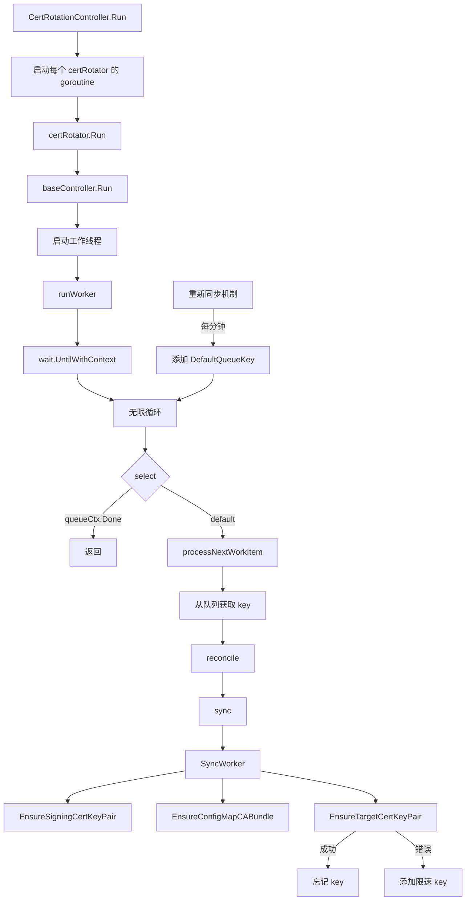
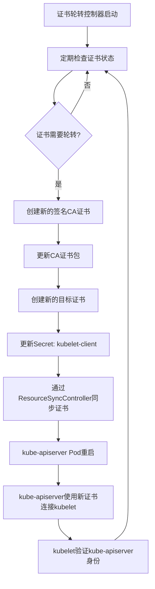

# Kubernetes 证书更替过程与监控方案

本文档详细介绍 Kubernetes 集群中的证书更替过程，特别是 kube-apiserver 到 kubelet 的证书轮转机制，以及如何在更新前和更新过程中对证书进行有效监控。

## 1. 证书轮转概述

在 Kubernetes 集群中，证书轮转是一个自动化过程，确保证书在过期前被更新，从而保持集群的安全性和可用性。证书轮转控制器（CertRotationController）负责管理多个证书轮转器，每个轮转器负责特定类型的证书。

### 1.1 证书轮转控制器结构

证书轮转控制器在 `pkg/operator/certrotationcontroller/certrotationcontroller.go` 中实现，主要包含以下组件：

```go
type CertRotationController struct {
    certRotators []factory.Controller
    // ... 其他字段
}
```

每个证书轮转器负责一种特定类型的证书，例如 `KubeAPIServerToKubeletClientCert`、`AggregatorProxyClientCert` 等。

### 1.2 证书轮转器配置

以 `KubeAPIServerToKubeletClientCert` 为例，其配置如下：

```go
certRotator = certrotation.NewCertRotationController(
    "KubeAPIServerToKubeletClientCert",
    certrotation.RotatedSigningCASecret{
        Namespace: operatorclient.OperatorNamespace,
        Name:      "kube-apiserver-to-kubelet-signer",
        AdditionalAnnotations: certrotation.AdditionalAnnotations{
            JiraComponent: "kube-apiserver",
        },
        Validity: 1 * 365 * defaultRotationDay, // 有效期为 1 年
        // 刷新时间设置为有效期的 80%
        Refresh:                292 * defaultRotationDay,
        RefreshOnlyWhenExpired: refreshOnlyWhenExpired,
        // ... 其他配置
    },
    // ... 其他配置
)
```

关键参数说明：
- **Validity**: 证书的有效期，这里设置为 1 年
- **Refresh**: 证书的刷新期，这里设置为 292 天（约为有效期的 80%）
- **RefreshOnlyWhenExpired**: 是否仅在证书过期时才刷新

## 2. 证书轮转内部机制

### 2.1 控制器执行流程



控制器启动后，会为每个证书轮转器创建一个 goroutine，每个轮转器都会运行一个无限循环，定期检查证书状态并在需要时进行轮转。

### 2.2 证书轮转过程

证书轮转过程包括三个主要步骤：

1. **EnsureSigningCertKeyPair**: 确保签名 CA 证书和密钥对有效，如果需要则创建或轮转它们
2. **EnsureConfigMapCABundle**: 使用当前签名 CA 证书更新 CA 证书包配置映射
3. **EnsureTargetCertKeyPair**: 确保目标证书和密钥对有效，如果需要则创建或轮转它们

### 2.3 证书轮转决策逻辑

控制器使用以下逻辑来决定何时轮转证书：

```go
func needNewTargetCertKeyPairForTime(annotations map[string]string, signer *crypto.CA, refresh time.Duration, refreshOnlyWhenExpired bool) string {
    // 检查证书是否已过期
    if time.Now().After(notAfter) {
        return "already expired"
    }

    // 如果设置了只在过期时刷新，则不进行提前刷新
    if refreshOnlyWhenExpired {
        return ""
    }

    // 检查是否达到有效期的 80%
    validity := notAfter.Sub(notBefore)
    at80Percent := notAfter.Add(-validity / 5)
    if time.Now().After(at80Percent) {
        return fmt.Sprintf("past its latest possible time %v", at80Percent)
    }

    // 检查是否达到预设的刷新时间
    refreshTime := notBefore.Add(refresh)
    if time.Now().After(refreshTime) {
        // 确保签名 CA 已有效超过目标刷新时间的 10%
        timeToWaitForTrustRotation := refresh / 10
        if time.Now().After(signer.Config.Certs[0].NotBefore.Add(time.Duration(timeToWaitForTrustRotation))) {
            return fmt.Sprintf("past its refresh time %v", refreshTime)
        }
    }

    return ""
}
```

证书轮转的触发条件包括：
- 证书已过期
- 证书有效期已达到 80%（如果 RefreshOnlyWhenExpired 为 false）
- 达到预设的刷新时间
- 签名 CA 已更改

## 3. 证书轮转事件与日志

### 3.1 事件触发机制

在证书轮转过程中，系统会在关键节点触发 Kubernetes 事件，这些事件可以通过 `kubectl get events` 命令查看。

#### 3.1.1 签名 CA 证书轮转事件

当签名 CA 证书需要轮转时，系统会触发事件：

```go
c.EventRecorder.Eventf("SignerUpdateRequired", "%q in %q requires a new signing cert/key pair: %v", c.Name, c.Namespace, reason)
```

#### 3.1.2 CA 证书包更新事件

当 CA 证书包需要更新时，系统会触发事件：

```go
c.EventRecorder.Eventf("CABundleUpdateRequired", "%q in %q requires a new cert", c.Name, c.Namespace)
```

#### 3.1.3 目标证书轮转事件

当目标证书需要轮转时，系统会触发事件：

```go
c.EventRecorder.Eventf("TargetUpdateRequired", "%q in %q requires a new target cert/key pair: %v", c.Name, c.Namespace, reason)
```

### 3.2 事件与证书更新的时间关系

**重要发现**：证书轮转事件和实际证书更新在同一个控制器周期内立即发生：

1. 控制器每分钟运行检查
2. 当证书需要轮转时，会发出事件（例如 `SignerUpdateRequired`）
3. 在同一个函数调用中，立即创建并应用新证书
4. 事件发出和证书更新之间没有延迟，它们是原子操作

### 3.3 日志记录机制

除了 Kubernetes 事件外，证书轮转过程中的关键操作也会记录到系统日志中：

```go
klog.Infof("Starting CertRotation")
klog.Infof("Waiting for CertRotation")
klog.V(2).Infof("Updated ca-bundle.crt configmap %s/%s with:\n%s", certs.CertificateBundleToString(updatedCerts), caBundleConfigMap.Namespace, caBundleConfigMap.Name)
```

## 4. kube-apiserver 到 kubelet 的证书轮转流程

### 4.1 证书轮转流程图



### 4.2 证书分发机制

证书创建后，通过 `ResourceSyncController` 进行分发。这个控制器负责将证书从源位置同步到目标位置。

在 `ManageClientCABundle` 函数中，证书被组合和分发：

```go
func ManageClientCABundle(ctx context.Context, lister corev1listers.ConfigMapLister, client coreclientv1.ConfigMapsGetter, recorder events.Recorder) (*corev1.ConfigMap, bool, error) {
    requiredConfigMap, err := resourcesynccontroller.CombineCABundleConfigMaps(
        resourcesynccontroller.ResourceLocation{Namespace: operatorclient.TargetNamespace, Name: "client-ca"},
        lister,
        certrotation.AdditionalAnnotations{
            JiraComponent: "kube-apiserver",
        },
        // ... 其他CA证书来源 ...
        // 这个bundle用于验证kube-apiserver与kubelet的通信
        resourcesynccontroller.ResourceLocation{Namespace: operatorclient.OperatorNamespace, Name: "kube-apiserver-to-kubelet-client-ca"},
        // ... 其他CA证书来源 ...
    )
    // ... 应用配置映射 ...
}
```

### 4.3 kubelet 如何验证 kube-apiserver 的证书

kubelet 不需要重新部署来接受新的 kube-apiserver 证书。这是因为：

1. 这个证书是 kube-apiserver 用来向 kubelet 进行身份验证的客户端证书
2. kubelet 验证 kube-apiserver 提供的证书是否由其信任的 CA 签名
3. kubelet 通过 `--kubelet-client-ca` 标志指定的 CA 证书文件来验证 kube-apiserver 的客户端证书

kubelet 的配置示例：

```bash
/usr/bin/kubelet --config=/etc/kubernetes/kubelet.conf --bootstrap-kubeconfig=/etc/kubernetes/kubeconfig --kubeconfig=/var/lib/kubelet/kubeconfig --container-runtime-endpoint=/var/run/crio/crio.sock ...
```

kubelet.conf 中的相关配置：

```yaml
"authentication": {
  "x509": {
    "clientCAFile": "/etc/kubernetes/kubelet-ca.crt"
  },
  "webhook": {
    "cacheTTL": "0s"
  },
  "anonymous": {
    "enabled": false
  }
},
```

OpenShift 4.14+ 中，`/etc/kubernetes/kubelet.conf` 配置由 Machine Config Operator 管理，`clientCAFile` 设置（指向 `/etc/kubernetes/kubelet-ca.crt`）也由 Machine Config Operator 维护。

### 4.4 CA 证书轮转机制

CA 证书（签名证书）本身也有有效期限制，并且也会自动轮转。从代码中可以看到，`kube-apiserver-to-kubelet-signer` CA 证书的配置如下：

```go
certrotation.RotatedSigningCASecret{
    Namespace: operatorclient.OperatorNamespace,
    Name:      "kube-apiserver-to-kubelet-signer",
    AdditionalAnnotations: certrotation.AdditionalAnnotations{
        JiraComponent: "kube-apiserver",
    },
    Validity: 1 * 365 * defaultRotationDay, // 有效期为1年
    Refresh:  292 * defaultRotationDay,     // 约80%的有效期后刷新
    RefreshOnlyWhenExpired: refreshOnlyWhenExpired,
    // ...
}
```

当 CA 证书轮转时，会发生以下过程：

1. 创建新的 CA 证书和密钥对
2. 将新的 CA 证书添加到 CA 证书包中
3. 旧的 CA 证书保留在证书包中，直到它过期
4. 新的目标证书将使用新的 CA 证书进行签名

这种机制确保了在 CA 证书轮转期间有一个平滑的过渡期，在此期间新旧 CA 证书都被信任。

## 5. 证书监控方案

为了有效监控证书的更新过程，我们可以实现一个第三方监控方案，用于监督证书的生命周期，在证书即将更新以及更新发生时创建事件通知。

### 5.1 监控方案设计

监控方案将：
1. 监控证书相关的 Secret 和 ConfigMap 资源
2. 计算证书的剩余有效期
3. 在证书即将更新时创建警告事件
4. 在证书更新后创建信息事件
5. 提供可视化界面展示证书状态

### 5.2 技术架构

主要组件：
- **证书监控控制器**: 核心组件，监控证书状态并生成事件
- **事件处理器**: 处理和转发证书相关事件
- **存储后端**: 存储证书状态历史数据
- **API 服务**: 提供 RESTful API 查询证书状态
- **Web 界面**: 可视化展示证书状态和历史记录

### 5.3 证书监控控制器实现

```go
// CertMonitorController 监控证书相关的 Secret 资源
type CertMonitorController struct {
    kubeClient    kubernetes.Interface
    secretLister  corelisters.SecretLister
    secretsSynced cache.InformerSynced
    workqueue     workqueue.RateLimitingInterface
    eventRecorder events.Recorder
    
    // 记录已处理的证书更新事件，避免重复事件
    processedCerts map[string]time.Time
}

// processCertificateData 处理证书数据并生成事件
func (c *CertMonitorController) processCertificateData(secret *corev1.Secret) error {
    // 查找证书数据
    var certData []byte
    for _, key := range []string{"tls.crt", "ca.crt"} {
        if data, ok := secret.Data[key]; ok {
            certData = data
            break
        }
    }
    
    if len(certData) == 0 {
        return nil
    }
    
    // 解析证书
    block, _ := pem.Decode(certData)
    if block == nil {
        return fmt.Errorf("failed to decode PEM block")
    }
    
    cert, err := x509.ParseCertificate(block.Bytes)
    if err != nil {
        return err
    }
    
    // 计算剩余有效期
    remainingTime := time.Until(cert.NotAfter)
    
    // 生成唯一标识符
    certID := fmt.Sprintf("%s/%s/%s", secret.Namespace, secret.Name, cert.SerialNumber.String())
    
    // 检查是否已处理过该证书
    lastProcessed, exists := c.processedCerts[certID]
    
    // 如果证书即将过期且未发送过警告
    if remainingTime < warningThreshold && (!exists || time.Since(lastProcessed) > 24*time.Hour) {
        c.eventRecorder.Warningf(
            "CertificateExpirationWarning",
            "Certificate in Secret %s/%s will expire in %.1f days",
            secret.Namespace, secret.Name, remainingTime.Hours()/24,
        )
        c.processedCerts[certID] = time.Now()
    }
    
    // 检测证书是否刚刚更新（通过比较上次处理时的过期时间）
    if exists {
        // 如果证书序列号变化，说明证书已更新
        if cert.SerialNumber.String() != certID[strings.LastIndex(certID, "/")+1:] {
            c.eventRecorder.Eventf(
                "CertificateRotated",
                "Certificate in Secret %s/%s has been rotated, new expiration: %s",
                secret.Namespace, secret.Name, cert.NotAfter.Format(time.RFC3339),
            )
            // 更新处理记录
            delete(c.processedCerts, certID)
            newCertID := fmt.Sprintf("%s/%s/%s", secret.Namespace, secret.Name, cert.SerialNumber.String())
            c.processedCerts[newCertID] = time.Now()
        }
    } else {
        // 首次处理该证书
        c.processedCerts[certID] = time.Now()
    }
    
    return nil
}
```

### 5.4 自定义资源定义 (CRD)

为了更好地管理证书监控配置，我们可以创建一个自定义资源定义：

```yaml
apiVersion: apiextensions.k8s.io/v1
kind: CustomResourceDefinition
metadata:
  name: certificatemonitors.monitoring.openshift.io
spec:
  group: monitoring.openshift.io
  names:
    kind: CertificateMonitor
    listKind: CertificateMonitorList
    plural: certificatemonitors
    singular: certificatemonitor
    shortNames:
    - certmon
  scope: Namespaced
  versions:
  - name: v1alpha1
    served: true
    storage: true
    schema:
      openAPIV3Schema:
        type: object
        properties:
          spec:
            type: object
            properties:
              targetNamespaces:
                type: array
                items:
                  type: string
              warningThresholdDays:
                type: integer
                minimum: 1
                maximum: 365
              secretSelectors:
                type: array
                items:
                  type: object
                  properties:
                    key:
                      type: string
                    operator:
                      type: string
                      enum: [In, NotIn, Exists, DoesNotExist]
                    values:
                      type: array
                      items:
                        type: string
          status:
            type: object
            properties:
              monitoredCertificates:
                type: array
                items:
                  type: object
                  properties:
                    namespace:
                      type: string
                    name:
                      type: string
                    notBefore:
                      type: string
                      format: date-time
                    notAfter:
                      type: string
                      format: date-time
                    serialNumber:
                      type: string
                    issuer:
                      type: string
                    subject:
                      type: string
                    remainingDays:
                      type: integer
```

### 5.5 Prometheus 监控与 Grafana 仪表板

为证书监控创建 ServiceMonitor 和 Grafana 仪表板：

```yaml
apiVersion: monitoring.coreos.com/v1
kind: ServiceMonitor
metadata:
  name: certificate-monitor
  namespace: openshift-monitoring
spec:
  selector:
    matchLabels:
      app: certificate-monitor
  endpoints:
  - port: metrics
    interval: 30s
```

Grafana 仪表板示例：

```json
{
  "annotations": {
    "list": []
  },
  "editable": true,
  "gnetId": null,
  "graphTooltip": 0,
  "id": 1,
  "links": [],
  "panels": [
    {
      "datasource": "Prometheus",
      "fieldConfig": {
        "defaults": {
          "color": {
            "mode": "thresholds"
          },
          "mappings": [],
          "thresholds": {
            "mode": "absolute",
            "steps": [
              {
                "color": "green",
                "value": null
              },
              {
                "color": "yellow",
                "value": 30
              },
              {
                "color": "red",
                "value": 7
              }
            ]
          },
          "unit": "d"
        },
        "overrides": []
      },
      "gridPos": {
        "h": 8,
        "w": 12,
        "x": 0,
        "y": 0
      },
      "id": 2,
      "options": {
        "orientation": "auto",
        "reduceOptions": {
          "calcs": [
            "lastNotNull"
          ],
          "fields": "",
          "values": false
        },
        "showThresholdLabels": false,
        "showThresholdMarkers": true
      },
      "pluginVersion": "7.5.5",
      "targets": [
        {
          "expr": "certificate_days_until_expiry",
          "interval": "",
          "legendFormat": "{{namespace}}/{{name}}",
          "refId": "A"
        }
      ],
      "title": "Certificate Days Until Expiry",
      "type": "gauge"
    }
  ],
  "refresh": "10s",
  "schemaVersion": 27,
  "style": "dark",
  "tags": [],
  "templating": {
    "list": []
  },
  "time": {
    "from": "now-6h",
    "to": "now"
  },
  "timepicker": {},
  "timezone": "",
  "title": "Certificate Monitoring",
  "uid": "certificates",
  "version": 1
}
```

## 6. 证书更新前后的监控操作

### 6.1 更新前的监控准备

在证书更新前，应该进行以下监控准备：

1. **部署证书监控控制器**：
   ```bash
   oc apply -f certificate-monitor-deployment.yaml
   ```

2. **配置监控目标**：
   ```bash
   oc apply -f - <<EOF
   apiVersion: monitoring.openshift.io/v1alpha1
   kind: CertificateMonitor
   metadata:
     name: cluster-certificates
     namespace: openshift-monitoring
   spec:
     targetNamespaces:
     - openshift-kube-apiserver
     - openshift-kube-apiserver-operator
     warningThresholdDays: 30
   EOF
   ```

3. **设置告警规则**：
   ```yaml
   apiVersion: monitoring.coreos.com/v1
   kind: PrometheusRule
   metadata:
     name: certificate-expiry-alerts
     namespace: openshift-monitoring
   spec:
     groups:
     - name: certificate.rules
       rules:
       - alert: CertificateExpiringInOneMonth
         expr: certificate_days_until_expiry < 30
         for: 1h
         labels:
           severity: warning
         annotations:
           summary: "Certificate expiring soon"
           description: "Certificate {{ $labels.namespace }}/{{ $labels.name }} will expire in {{ $value }} days"
       - alert: CertificateExpiringInOneWeek
         expr: certificate_days_until_expiry < 7
         for: 1h
         labels:
           severity: critical
         annotations:
           summary: "Certificate expiring very soon"
           description: "Certificate {{ $labels.namespace }}/{{ $labels.name }} will expire in {{ $value }} days"
   ```

4. **检查当前证书状态**：
   ```bash
   oc get secrets -n openshift-kube-apiserver kube-apiserver-to-kubelet-signer -o yaml
   ```

5. **查看证书相关事件**：
   ```bash
   oc get events --field-selector reason=CertificateExpirationWarning,CertificateRotated
   ```

### 6.2 更新过程中的监控操作

在证书更新过程中，应该进行以下监控操作：

1. **实时监控证书轮转事件**：
   ```bash
   oc get events -w | grep -i "certificate\|cert\|rotation"
   ```

2. **监控控制器日志**：
   ```bash
   oc logs -f deployment/certificate-monitor -n openshift-monitoring
   ```

3. **监控 kube-apiserver 操作员日志**：
   ```bash
   oc logs -f deployment/kube-apiserver-operator -n openshift-kube-apiserver-operator
   ```

4. **检查证书更新状态**：
   ```bash
   oc get certificatemonitor cluster-certificates -n openshift-monitoring -o yaml
   ```

5. **监控 kube-apiserver Pod 重启**：
   ```bash
   oc get pods -n openshift-kube-apiserver -w
   ```

### 6.3 更新后的验证操作

在证书更新后，应该进行以下验证操作：

1. **验证新证书已生效**：
   ```bash
   oc get secrets -n openshift-kube-apiserver kubelet-client -o yaml
   ```

2. **检查证书有效期**：
   ```bash
   oc get certificatemonitor cluster-certificates -n openshift-monitoring -o jsonpath='{.status.monitoredCertificates[?(@.name=="kubelet-client")].notAfter}'
   ```

3. **验证 kube-apiserver 与 kubelet 通信正常**：
   ```bash
   oc get nodes
   ```

4. **检查是否有错误事件**：
   ```bash
   oc get events --field-selector type=Warning
   ```

5. **验证 Grafana 仪表板显示正确的证书信息**：
   通过 OpenShift 控制台访问 Grafana 仪表板，确认证书信息已更新。

## 7. 总结

证书轮转是 Kubernetes 集群安全机制的重要组成部分。通过了解证书轮转的内部机制和实现适当的监控方案，可以确保证书更新过程的平稳进行，避免因证书过期导致的服务中断。

在证书更新前和更新过程中进行有效监控，可以帮助管理员及时发现潜在问题，确保集群的安全和稳定运行。通过部署证书监控控制器、设置告警规则、实时监控事件和日志，以及更新后的验证操作，可以全面掌握证书的生命周期管理。
